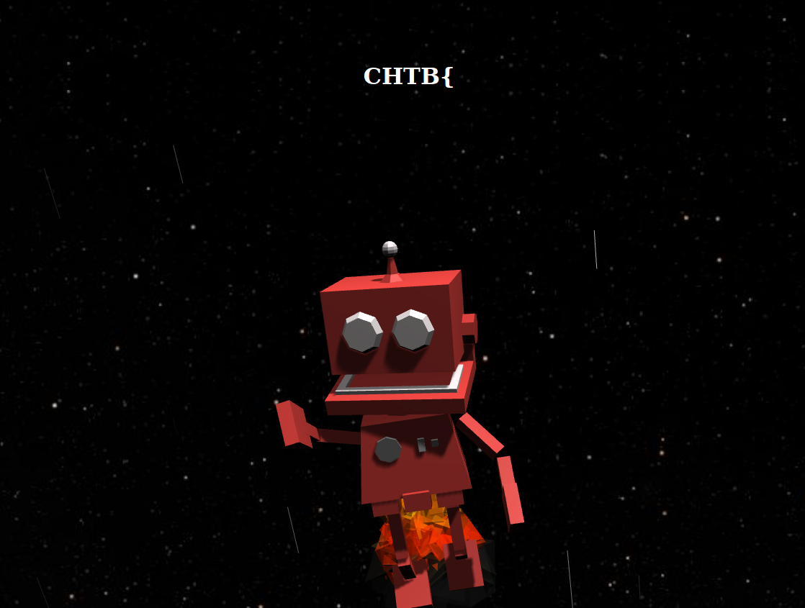

# Info

| #     |   |
|:--    |:--|
Type    |CTF / Web
Name    | **Cyber Apocalypse 2021 / Inspector Gadget**
Started | 2021/04/19 08:30 PM
URLs    | https://ctf.hackthebox.eu/ctf/82
|       | https://ctftime.org/event/1304
Author	| **Asentinn** / OkabeRintaro
|		| [https://ctftime.org/team/152207](https://ctftime.org/team/152207)

# ToE

We are given the IP and a port as a target of evaluation:

* `46.101.54.25:31511`

# Recon

Doing the initial scan with `nmap` to find more about the ToE:

`sudo nmap -A -Pn -p 31511 46.101.54.25 -oN nmap/initial.nmap`

```
# Nmap 7.91 scan initiated Mon Apr 19 20:48:54 2021 as: nmap -A -Pn -p 31511 -oN nmap/initial.nmap 46.101.54.25
Nmap scan report for 46.101.54.25
Host is up (0.043s latency).

PORT      STATE SERVICE VERSION
31511/tcp open  unknown
| fingerprint-strings: 
|   GetRequest: 
|     HTTP/1.1 200 OK
|     accept-ranges: bytes
|     cache-control: public, max-age=0
|     last-modified: Mon, 19 Apr 2021 04:45:39 GMT
|     etag: W/"2ef-178e872c538"
|     content-type: text/html; charset=UTF-8
|     content-length: 751
|     Date: Mon, 19 Apr 2021 18:49:07 GMT
|     Connection: close
|     <html lang="en">
|     <head>
|     <meta charset="UTF-8">
|     <title>Inspector Gadget</title>
|     <meta name="viewport" content="width=device-width, initial-scale=1, user-scalable=no">
|     <link rel="icon" href="/static/images/favicon.png">
|     <link rel="stylesheet" href="/static/css/main.css">
|     </head>
|     <body>
|     <center><h1>CHTB{</h1></center>
|     <div id="container"></div>
|     </body>
|     <script src='https://cdnjs.cloudflare.com/ajax/libs/three.js/87/three.min.js'></script>
|     <script src='https://threejs.org/examples/js/controls/OrbitControls.js'></script>
|     <script src='https://cdnjs.cloudflare.com/ajax/lib
|   HTTPOptions: 
|     HTTP/1.1 404 Not Found
|     content-type: application/json; charset=utf-8
|     content-length: 76
|     Date: Mon, 19 Apr 2021 18:49:07 GMT
|     Connection: close
|     {"message":"Route OPTIONS:/ not found","error":"Not Found","statusCode":404}
|   RPCCheck, RTSPRequest: 
|     HTTP/1.1 400 Bad Request
|     Content-Length: 65
|     Content-Type: application/json
|_    {"error":"Bad Request","message":"Client Error","statusCode":400}
1 service unrecognized despite returning data. If you know the service/version,
  please submit the following fingerprint at https://nmap.org/cgi-bin/submit.cgi?new-service :
SF-Port31511-TCP:V=7.91%I=7%D=4/19%Time=607DD0A3%P=x86_64-pc-linux-gnu%r(G
SF:etRequest,3F8,"HTTP/1\.1\x20200\x20OK\r\naccept-ranges:\x20bytes\r\ncac
SF:he-control:\x20public,\x20max-age=0\r\nlast-modified:\x20Mon,\x2019\x20
SF:Apr\x202021\x2004:45:39\x20GMT\r\netag:\x20W/\"2ef-178e872c538\"\r\ncon
SF:tent-type:\x20text/html;\x20charset=UTF-8\r\ncontent-length:\x20751\r\n
SF:Date:\x20Mon,\x2019\x20Apr\x202021\x2018:49:07\x20GMT\r\nConnection:\x2
SF:0close\r\n\r\n<html\x20lang=\"en\">\n\x20\x20\x20<head>\n\x20\x20\x20\x
SF:20\x20\x20<meta\x20charset=\"UTF-8\">\n\x20\x20\x20\x20\x20\x20<title>I
SF:nspector\x20Gadget</title>\n\x20\x20\x20\x20\x20\x20<meta\x20name=\"vie
SF:wport\"\x20content=\"width=device-width,\x20initial-scale=1,\x20user-sc
SF:alable=no\">\n\x20\x20\x20\x20\x20\x20<link\x20rel=\"icon\"\x20href=\"/
SF:static/images/favicon\.png\">\n\x20\x20\x20\x20\x20\x20<link\x20rel=\"s
SF:tylesheet\"\x20href=\"/static/css/main\.css\">\n\x20\x20\x20</head>\n\x
SF:20\x20\x20<body>\n\x20\x20\x20\x20\x20\x20<center><h1>CHTB{</h1></cente
SF:r>\n\x20\x20\x20\x20\x20\x20<div\x20id=\"container\"></div>\n\x20\x20\x
SF:20</body>\n\x20\x20\x20<script\x20src='https://cdnjs\.cloudflare\.com/a
SF:jax/libs/three\.js/87/three\.min\.js'></script>\n\x20\x20\x20<script\x2
SF:0src='https://threejs\.org/examples/js/controls/OrbitControls\.js'></sc
SF:ript>\n\x20\x20\x20<script\x20src='https://cdnjs\.cloudflare\.com/ajax/
SF:lib")%r(HTTPOptions,E1,"HTTP/1\.1\x20404\x20Not\x20Found\r\ncontent-typ
SF:e:\x20application/json;\x20charset=utf-8\r\ncontent-length:\x2076\r\nDa
SF:te:\x20Mon,\x2019\x20Apr\x202021\x2018:49:07\x20GMT\r\nConnection:\x20c
SF:lose\r\n\r\n{\"message\":\"Route\x20OPTIONS:/\x20not\x20found\",\"error
SF:\":\"Not\x20Found\",\"statusCode\":404}")%r(RTSPRequest,91,"HTTP/1\.1\x
SF:20400\x20Bad\x20Request\r\nContent-Length:\x2065\r\nContent-Type:\x20ap
SF:plication/json\r\n\r\n{\"error\":\"Bad\x20Request\",\"message\":\"Clien
SF:t\x20Error\",\"statusCode\":400}")%r(RPCCheck,91,"HTTP/1\.1\x20400\x20B
SF:ad\x20Request\r\nContent-Length:\x2065\r\nContent-Type:\x20application/
SF:json\r\n\r\n{\"error\":\"Bad\x20Request\",\"message\":\"Client\x20Error
SF:\",\"statusCode\":400}");
Warning: OSScan results may be unreliable because we could not find at least 1 open and 1 closed port
Device type: bridge
Running: Oracle Virtualbox
OS CPE: cpe:/o:oracle:virtualbox
OS details: Oracle Virtualbox
Network Distance: 2 hops

TRACEROUTE (using port 31511/tcp)
HOP RTT      ADDRESS
1   1.30 ms  XXX.XXX.XXX.XXX
2   62.76 ms 46.101.54.25

OS and Service detection performed. Please report any incorrect results at https://nmap.org/submit/ .
# Nmap done at Mon Apr 19 20:49:12 2021 -- 1 IP address (1 host up) scanned in 19.36 seconds
```

Given port is a TCP open port for which `nmap` could not determine OS version although `-A` (OS detection, version detection, script scanning, and traceroute) option is specified.

## Website

Let's try open this in browser as GET gives some HTML code.



It shows the flying robot with the `CHTB{` in the middle. Inspecting the page source code:

* `<!--1nsp3ction_-->` comment
* `https://threejs.org/examples/js/controls/OrbitControls.js` script

The robot and the scenery seems to originate from the following repository:

* `https://zultanzul.github.io/ThreeJS-Robot/`

But on ToE we rotate the camera is disabled - maybe we need to enable this by updating `update()` method in `/static/js/main.js`?

### /static/js/main.js

Starts with `console.log`, that apparently I've missed:

```js
console.log("us3full_1nf0rm4tion}");
```

Now checking the combination of the two phrases I've found so far.

The following are **not** the correct flags:

* `CHTB{us3full_1nf0rm4tion}`
* `CHTB{us3full_1nf0rm4tion1nsp3ction_}`
* `CHTB{us3full_1nf0rm4tion_1nsp3ction}`
* `CHTB{1nsp3ction_us3full_1nf0rm4tion}`

After trying to enable controls that are disabled in the `update()` (`THREE.TOUCH not defined` error). I'm moving to look in the other files.

### /static/css/main.css

```css
/* c4n_r3ve4l_ */
```

Let's try then once again to assemble the flag.

* `CHTB{1nsp3ction_c4n_r3ve4l_us3full_1nf0rm4tion}` 

This is a correct flag!

# Flag

> **CHTB{1nsp3ction_c4n_r3ve4l_us3full_1nf0rm4tion}**