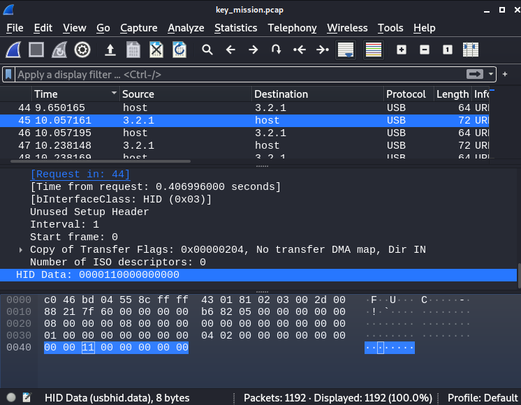

# Info

| #     |   |
|:--    |:--|
Type    |CTF / Forensics
Name    | **Cyber Apocalypse 2021 / Key Mission**
Started | 2021/04/23
URLs    | https://ctf.hackthebox.eu/ctf/82
|       | https://ctftime.org/event/1304
Author	| **Asentinn** / OkabeRintaro
|		| [https://ctftime.org/team/152207](https://ctftime.org/team/152207)

# ToE

We are given the `key_mission.pcap` file.

# Analysis

As always, start with `file` to get initial information.

```
$ file key_mission.pcap         

key_mission.pcap: pcap capture file, microsecond ts (little-endian) - version 2.4 (Memory-mapped Linux USB, capture length 262144)
```

Ok, so we have the packet capture file. And specifically, USB keystroke keylogger output. Maybe try `tshark` to extract keystrokes automatically?

```
tshark -r key_mission.pcap -T fields -e usb.capdata > keystrokes.txt
```

Unfortunately, it just leaves a lot of new lines (or maybe my parameters are wrong). Let's fire up the `Wireshark` and look at the packets itself.

# Parsing the packet file

With the great support of the AliBawazeEer's writeup from Kaizen CTF 2018 (check _Additional readings_ section) we know what to do. I'm also using the script provided by the AliBawazeEer to map the hex codes to actual key inputs.

I'm opening pcap with `Wireshark`. Notice that there are multiple sequences of packets with 64 and 72 bytes of data - we are interested in these 72 ones because they carry the keystroke data in the `HID Data`.



So let's filter the interesting ones: `frame.len == 72`. And save it as a CSV (_File_ -> _Export Packets Dissections_ -> _As CSV.._).

## `01_keystrokes_packets.csv`

Extract just the hex values of the keystrokes.

`cat dumps/01_keystrokes_packets.csv | cut -d "," -f 7 | cut -d "\"" -f 2 > dumps/02_keystrokes_hex.txt`

`-d "{char}"` to set delimiter, `-f {n}` to select only the nth value in each row. We are `cut`ting twice: first to select only the column containing the hex, then to cut off surrounding `"`.

## `02_keystrokes_hex.txt`

Now it's time forhex to actual key values conversion. For this I'm using the modified version of the AliBawazeEer's script:

```python
# Original version by AliBawazeEer

newmap = {
2: "shift",
4: "a",
5: "b",
6: "c",
7: "d",
8: "e",
9: "f",
10: "g",
11: "h",
12: "i",
13: "j",
14: "k",
15: "l",
16: "m",
17: "n",
18: "o",
19: "p",
20: "q",
21: "r",
22: "s",
23: "t",
24: "u",
25: "v",
26: "w",
27: "x",
28: "y",
29: "z",
30: "1",
31: "2",
32: "3",
33: "4",
34: "5",
35: "6",
36: "7",
37: "8",
38: "9",
39: "0",
40: "Enter",
41: "esc",
42: "del",
43: "tab",
44: "space",
45: "-",
47: "[",
48: "]",
56: "/",
57: "CapsLock",
79: "RightArrow",
80: "LetfArrow"
}

myKeys = open("dumps/02_keystrokes_hex.txt")

with open('dumps/03_keystrokes.txt', 'w') as output:
	for line in myKeys:
		bytesArray = bytearray.fromhex(line.strip())
		for byte in bytesArray:
			if byte != 0:
				keyVal = int(byte)

			if keyVal in newmap:
				output.write(newmap[keyVal]+"\n")
			#else:
				#output.write("No map found for this value: " + str(keyVal))
```

## `03_keystrokes.txt`

Now we need to remove the duplicates and make some sense of this.

```python
# truncate.py (v1.0)

with open('dumps/03_keystrokes.txt', 'r') as inFile:
	with open('dumps/04_truncated_message.txt', 'w') as outFile:
		lastline = ""
		repeats = 0
		for line in inFile:
			line = line.strip()
			if (line == lastline) and (repeats < 16):
				repeats+=1
				continue
			if (line == "space"):
				outFile.write(" ")		
			else:
				outFile.write(line)		
			lastline = line
				repeats = 0	
```

I've noticed that single character input spans across at most 16 interruptions. So to not loose some multi-keystrokes I'm counting how many same inputs I had. I'm stripping the newline and write to the output.

## `04_truncated_message.txt`

```
i am sending secretarys location over this totally encrypted channel to make sure no one else will be able to read it except of us this information is confidential and must not be shared with anyone else the secretarys hidden location is chtb[a-plac3-far-far-away-fr0m-eaedelrth]
```

Ok, this definitely misses `Shift` inputs interpretation. Let's try the updated version.

```python
# truncate.py (v1.1)

with open('dumps/03_keystrokes.txt', 'r') as inFile:
	with open('dumps/04_truncated_message.txt', 'w') as outFile:
		lastline = ""
		repeats = 0
		uppercase = 0;
		for line in inFile:
			line = line.strip()
			if (line == lastline) and (repeats < 17):
				repeats+=1
				continue

			if (line == "space"):
				outFile.write(" ")
				uppercase = 0
			else:
				if (line == "shift"):
					uppercase = 1
				else:
					if uppercase:
						outFile.write(line.upper())
						uppercase = 0
					else:
						outFile.write(line)	
			lastline = line
			repeats = 0	
```

```
I am sending secretarys location over this totally encrypted channel to make sure no one else will be able to read it except of us THis information is confidential and must not be shared with anyone else THe secretarys hidden location is CHTB[A-Plac3-FAR-FAR-Away-Fr0m-Eaedelrth]
```

But unfortunately, this also is not the correct flag. By analyzing the `03_keystrokes.txt` I see that this is not `Eaedelrth` but `Earth`, because last few strokes are `del`.. `CHTB{A_Plac3_FAR_FAR_Away_Fr0m_Earth}` is also wrong.

When I stared a bit longer at the intermediate files I realized I've got the casing wrong all the time. I've been interpreting `shift` packets as an uppercase switch for the next character. Which is clearly wrong, because `shift`s come in two patterns: 10 and 18 inputs. So it clearly must mean press and release!

Let's try again.

```python
#truncate.py (1.2)

with open('dumps/03_keystrokes.txt', 'r') as inFile:
	with open('dumps/04_truncated_message.txt', 'w') as outFile:
		lastline = ""
		repeats = 0
		uppercase = 0
		shiftCount = 0
		for line in inFile:
			line = line.strip()
			if (line == lastline) and (repeats < 17):
				repeats += 1
				if line != "shift":
					continue

			if (line == "space"):
				outFile.write(" ")
				repeats = 0	
			else:
				if (line == "shift"):
					shiftCount += 1
					if shiftCount == 10 and uppercase == 0:
						uppercase = 1
						shiftCount = 0
					else:
						if shiftCount == 18 and uppercase == 1:
							uppercase = 0
							shiftCount = 0
				else:
					if uppercase:
						outFile.write(line.upper())
						shiftCount = 0
					else:
						outFile.write(line)	
					repeats = 0	
			lastline = line
```

```
I am sending secretarys location over this totally encrypted channel to make sure no one else will be able to read it except of us This information is confidential and must not be shared with anyone else The secretarys hidden location is CHTB[A-plac3-fAr-fAr-away-fr0m-eaedelrth]
```

Script is not perfect: the first character in flag `A` should be lowercase. This is because between `[` and `a` are 36 `shift`s, not 38 - I don't know why. Maybe I've lost some during the parsing.

# Flag

> **CHTB{a_plac3_fAr_fAr_away_fr0m_earth}**

# Additional readings

* [kaizen-ctf 2018 — Reverse Engineer usb keystrok from pcap file](https://abawazeeer.medium.com/kaizen-ctf-2018-reverse-engineer-usb-keystrok-from-pcap-file-2412351679f4)
* [USB HID Usage Tables](https://www.usb.org/sites/default/files/documents/hut1_12v2.pdf)
* [man cut](https://man7.org/linux/man-pages/man1/cut.1.html)